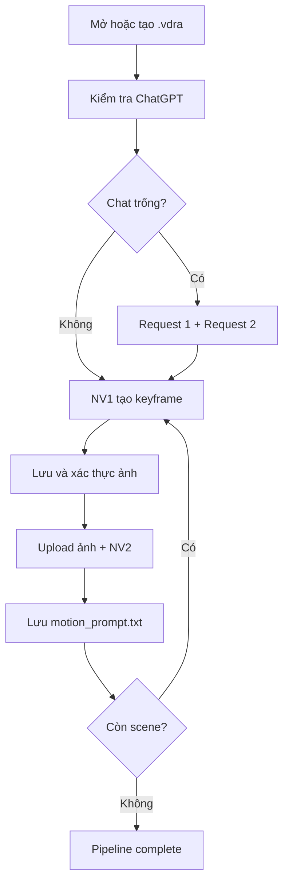

# VIDORA — Phân tích chức năng, lịch sử thay đổi và tài liệu bàn giao

> Ngày tổng hợp: 2026-07-16 (Asia/Ho_Chi_Minh)  
> Mục đích: cung cấp ngữ cảnh kỹ thuật đủ để một assistant khác có thể tiếp quản Vidora mà không phải suy đoán lại lịch sử dự án.

## 1. Kết luận quan trọng nhất

Vidora là ứng dụng Electron tự động hóa luồng làm việc theo từng scene với ChatGPT thông qua Chrome/Edge đang đăng nhập và cổng CDP. Đích hiện tại của bản mới nhất là:

```text
Request 1 (preprompt) -> Request 2 (tối đa 5 keyframe cũ)
-> NV1 tạo và lưu ảnh keyframe
-> NV2 tạo và lưu motion prompt
-> scene kế tiếp
```

**Bản hiện tại là Vidora 1.1.0 “NV1 + NV2 only”.** Nó không còn tạo video trong app, không còn Grok, PixVerse, VeoUp hay FFmpeg trong runtime hiện tại.

Điểm này rất dễ bị hiểu nhầm vì lịch sử có một giai đoạn trung gian mà đường chạy production là:

```text
ChatGPT NV1 -> ChatGPT NV2 -> VeoUp -> video đã xác thực
```

Sau khi Grok/PixVerse được loại bỏ, VeoUp từng được giữ làm video provider duy nhất. Tuy nhiên, ở bước cuối chúng ta tiếp tục thu gọn sản phẩm thành **chỉ NV1 + NV2**. Assistant tiếp quản không được lấy tài liệu Phase 3 VeoUp làm trạng thái hiện tại và không được tự khôi phục VeoUp nếu người dùng chưa yêu cầu rõ.

## 2. Nguồn được dùng để đối chiếu

Tài liệu này được tổng hợp từ:

- Snapshot gốc người dùng giao: `electron (2).zip`, ngày 2026-07-12.
- Các manifest Phase 1, Phase 2, Phase 3 và hotfix Request 2/NV1.
- Source `Vidora-agent-turn-fix-gray-wrapper-v6.zip`, ngày 2026-07-15.
- Gói cập nhật mới nhất `Vidora-1.1.0-update.zip`; `app.asar` đã được giải nén để rà trực tiếp runtime hiện tại.
- Log thực tế người dùng đã gửi trong quá trình sửa Request 2, NV1, NV2, grey wrapper và lỗi OOM.

Thứ tự ưu tiên khi có mâu thuẫn:

1. Runtime trong `Vidora-1.1.0-update.zip`.
2. README/changelog của Vidora 1.1.0.
3. Source gray-wrapper v6 và `FINAL_CHANGE_MANIFEST.md` cho lịch sử sửa lỗi ChatGPT dài hạn.
4. Manifest Phase 1–3 cho lịch sử loại provider.
5. Snapshot `electron (2).zip` chỉ là baseline ban đầu.

## 3. Phạm vi sản phẩm hiện tại

### Chức năng đang có

- Tạo, mở, lưu và tự lưu project `.vdra`.
- Tách kịch bản thành nhiều scene và chạy theo batch.
- Quản lý thư mục `preprompt` riêng của project.
- Mở/check phiên đăng nhập ChatGPT trong Chrome/Edge dùng remote debugging.
- Trên chat trống: chạy Request 1 rồi Request 2 trước NV1.
- NV1 gửi prompt tạo đúng một keyframe, chờ, nhận, kiểm tra và lưu ảnh vào đúng folder scene.
- NV2 upload keyframe vừa lưu, gửi prompt motion, đợi response ổn định và lưu `motion_prompt.txt`.
- Resume scene dở; skip ngay scene đã đủ NV1 + NV2.
- Pause, resume, stop/cancel toàn pipeline.
- Review ảnh/prompt, sửa prompt, approve hoặc regenerate.
- Log pipeline trong UI, copy log, crash log và app log.
- Theo dõi bộ nhớ, nhận biết crash/OOM và bảo trì chat dài hạn bằng refresh cùng conversation.
- Tương thích mở project cũ có field Grok/PixVerse; field cũ bị bỏ qua và loại khỏi lần lưu tiếp theo.

### Chức năng đã bị loại khỏi bản hiện tại

- Grok và toàn bộ account router của Grok.
- PixVerse và mọi cấu hình/energy/UI liên quan.
- VeoUp automation và video handoff.
- Tạo, tải xuống hoặc kiểm tra video trong app.
- FFmpeg nhúng.
- Tự động xoay sang conversation ChatGPT mới.
- Tự chọn một chat trong sidebar để tiếp tục pipeline.

## 4. Kiến trúc runtime Vidora 1.1.0

| Thành phần | Trách nhiệm hiện tại |
| --- | --- |
| `electron/main.js` | Entry point/composition; project `.vdra`; account ChatGPT; prompt files; Chrome debug; Playwright/CDP; crash hooks; dependency injection cho các module. |
| `electron/preload.js` | IPC bridge an toàn từ renderer sang main; `contextIsolation=true`, `nodeIntegration=false`. |
| `electron/renderer.js` | UI, scene/batch workflow, review, start/pause/resume/stop, autosave, resume guard và trạng thái project. |
| `electron/index.html`, `style.css` | Dashboard và giao diện review/log/settings. |
| `main/bootstrap/` | Khởi tạo app/BrowserWindow; handshake flush project trước khi đóng cửa sổ. |
| `main/ipc/` | Đăng ký IPC handler và wrapper trả lỗi/dữ liệu an toàn. |
| `main/pipeline/pipeline_runner.js` | Pipeline scene bền vững, lock chống chạy trùng, retry, cancel, resume, kiểm tra đầu ra NV1/NV2. |
| `main/chatgpt/browser_adapter.js` | Adapter Playwright-over-CDP; tương thích một phần với API CDP cũ. |
| `main/chatgpt/chatgpt_core.js` | `evaluate`, đọc trạng thái conversation/composer và load gate. |
| `main/chatgpt/chatgpt_dom.js` | Các script phát hiện DOM ChatGPT: login, composer, user/assistant turn, image card, blocking UI. |
| `main/chatgpt/chatgpt_upload.js` | Upload file/keyframe; batch upload; đợi toàn bộ attachment sẵn sàng. |
| `main/chatgpt/chatgpt_upload_readiness.js` | Chuẩn hóa đường dẫn và xác nhận đủ attachment, hết progress. |
| `main/chatgpt/chatgpt_send.js` | Robust send ladder, input gate, click/Enter fallback, xác minh prompt đã thành user message. |
| `main/chatgpt/chatgpt_runtime_monitor.js` | Theo dõi state như IDLE/HYDRATING/STREAMING_TEXT/STREAMING_IMAGE, DOM mutation và network. |
| `main/chatgpt/chatgpt_recovery.js` | Chính sách reload an toàn, crash/login/blocking UI recovery, cấm auto-new-chat. |
| `main/chatgpt/chatgpt_pipeline.js` | Request 1/2, NV1, image extraction, grey-wrapper recovery, text-only retry và NV2 response capture. |
| `main/state/` | Hash prompt, snapshot scene, action journal, ownership và chọn assistant response đúng lượt. |
| `main/logging/` | Log file/UI, rút gọn DOM nặng và che password/token/email/URL nhạy cảm. |
| `main/memory/` | Đo main/renderer/ChatGPT tab memory, DOM nodes, documents, listeners và cảnh báo leak. |
| `main/recovery/` | Backoff retry bền vững. |
| `main/utils/` | File/path/image validation và tiện ích chung. |

Runtime hiện tại có dependency trực tiếp:

```json
{
  "playwright": "^1.61.1",
  "playwright-core": "^1.61.1"
}
```

Trình duyệt mặc định được nối qua CDP ở `http://127.0.0.1:9223/`. Playwright attach vào tab ChatGPT đã đăng nhập; ứng dụng không dùng browser bundle riêng của Playwright.

## 5. Luồng thực thi chi tiết



### 5.1 Khởi tạo project

- Project dùng schema `.vdra` version 1.
- Khi tạo project `Demo`, app tạo `Demo.vdra` cạnh folder `Demo/`.
- Nếu file hoặc folder đã tồn tại, app từ chối tạo để tránh ghi đè.
- Folder project có `preprompt/`, các folder `scene_NNN/` và checkpoint pipeline.
- App nhớ project gần nhất và tự mở lại ở lần chạy sau nhưng luôn chờ người dùng bấm Start.
- Autosave có debounce khoảng 1 giây; checkpoint quan trọng được lưu ngay; đóng cửa sổ sẽ yêu cầu renderer flush trước tối đa 7 giây.
- Payload project được kiểm tra schema và loại secret-like fields trước khi ghi.

### 5.2 Request 1 — nạp preprompt

Chỉ chạy khi chat đang trống/fresh:

1. Đọc tất cả file trong `project/preprompt/`.
2. Upload file lên composer.
3. Gửi prompt Request 1.
4. Không coi Stop button, composer rỗng hoặc state HYDRATING là bằng chứng đủ.
5. Chỉ chuyển sang WAIT khi hash của latest user message đúng bằng hash Request 1.
6. Chỉ hoàn tất khi có assistant response mới/đổi, nội dung mang nghĩa ready và không còn generating.

### 5.3 Request 2 — nạp tối đa 5 keyframe trước

1. Lấy tối đa 5 keyframe gần nhất có scene ID nhỏ hơn scene hiện tại.
2. Upload theo một batch.
3. Đợi attachment count đủ, progress biến mất và trạng thái ổn định qua nhiều poll.
4. Gửi Request 2 sau khi upload hoàn tất.
5. Xác minh latest user-message hash thuộc Request 2 trước khi vào WAIT.
6. Chỉ nhận assistant response nằm sau đúng user turn Request 2.

Nếu scene đầu không có keyframe cũ, app vẫn gửi Request 2 dạng acknowledgement để giữ đúng state machine.

### 5.4 NV1 — tạo và lấy ảnh keyframe

1. Tạo prompt cuối từ `NV1_TAO_ANH.txt` + scene hiện tại.
2. Lưu baseline assistant count và image-agent-turn count riêng cho scene.
3. Gửi NV1 và xác minh đồng thời:
   - conversation ID không đổi;
   - latest user-message hash thuộc NV1 hiện tại.
4. Chỉ quét ảnh trong image-generation card của `.agent-turn`; không quét logical assistant text root để tìm ảnh.
5. Selector không còn phụ thuộc `alt="Generated image"` tiếng Anh. Ảnh vẫn phải đúng image card, visible, load xong, đúng kích thước/nội dung và thuộc lượt NV1 hiện tại.
6. Có nhiều đường lấy ảnh: network response, DOM image/blob và screenshot phần tử khi cần.
7. Ảnh cuối được decode thành PNG, kiểm tra rồi lưu thành `scene_NNN_keyframe.png`.

Chính sách timeout/retry NV1 đã thiết kế:

- Chờ lượt đầu tối đa khoảng 8 phút.
- F5 đúng conversation hiện tại, xác minh lại conversation ID/hash rồi chờ thêm khoảng 5 phút.
- Nếu ChatGPT trả lời text-only hợp lệ, gửi `RETRY 1` đúng một lần trong cùng conversation.
- Không lấy ảnh scene cũ và không resend vô hạn.

### 5.5 Grey wrapper và DOM virtualization

Hai lỗi đặc trưng đã được xử lý:

- **Grey wrapper:** ảnh đã tạo nhưng wrapper xám còn treo sau khi Stop biến mất. App chờ 15 giây rồi F5 đúng chat tối đa một lần, sau đó xác minh lại conversation ID và hash NV1, không gửi lại prompt.
- **DOM virtualization:** ChatGPT unmount các `.agent-turn` cũ làm baseline tuyệt đối lớn hơn số turn đang mount. App chỉ rebase khi image card nằm sau đúng NV1 user turn, ảnh hoàn chỉnh, không còn Stop/placeholder và ownership hash vẫn đúng.

### 5.6 NV2 — tạo motion prompt

1. Xác thực keyframe trên đĩa trước khi bước vào motion stage.
2. Upload keyframe hiện tại và đợi attachment ready.
3. Gửi nội dung từ `NV2_MOTION_PROMPT.txt`.
4. Xác minh user-message ownership trước khi chờ response.
5. Chấp nhận assistant node mới hoặc trường hợp ChatGPT tái sử dụng node cũ nhưng text/hash thay đổi tại chỗ.
6. Chỉ hoàn tất khi:
   - response thuộc đúng NV2 user turn;
   - nội dung hợp lệ, hiện yêu cầu tối thiểu khoảng 120 ký tự;
   - hash ổn định ít nhất 3 poll;
   - text không đổi ít nhất 4 giây;
   - không còn hard-generating;
   - không còn soft-busy.
7. Timeout NV2 khoảng 300 giây cho mỗi phase; app có thể refresh cùng chat một lần và tiếp tục chờ, không resend NV2 trùng.

Phân loại tín hiệu NV2:

- **Hard-generating:** Stop button, streaming indicator hoặc runtime thực sự ở STREAMING_TEXT.
- **Soft-busy:** composer busy, active generation marker, HYDRATING, WAITING_SEND, UPLOADING hoặc monitor DOM còn báo generation active.

Mục tiêu của việc tách hai nhóm là không để composer busy mềm làm NV2 chờ vô hạn sau khi text đã hoàn tất, nhưng cũng không lưu response khi ChatGPT còn streaming thật.

### 5.7 Hoàn tất, skip và scene kế tiếp

Một scene chỉ được coi là hoàn tất khi có đủ:

- đường dẫn ảnh đúng folder scene;
- motion prompt không rỗng;
- `motion_prompt.txt`;
- `completionStatus = "nv1_nv2_complete"`.

Renderer không còn chờ cố định 10 giây cho scene đã xong. Scene đủ output bị loại khỏi `scenesToRun` và pipeline đi tiếp ngay. Resume guard luôn kéo pipeline về scene chưa đủ NV1/NV2 đầu tiên để tránh bỏ lỗ hổng continuity.

### 5.8 Retry, pause và cancel

- Mỗi scene có lock theo `outputFolder + sceneId`, vì vậy IPC gọi trùng sẽ join run hiện có thay vì mở thêm chat/run.
- Cancel dùng run ID, giải phóng waiter, child process và ChatGPT/pipeline locks.
- Lỗi được retry tối đa 2 chu kỳ phục hồi.
- Sau giới hạn, app ghi checkpoint, đặt `waitingForUserStart=true`, pause và yêu cầu người dùng bấm Start lại; không lặp vô hạn.
- Ảnh hỏng trước NV2 bị xóa và NV1 được regenerate thay vì retry mãi trên file hỏng.

## 6. Hệ thống trạng thái bền vững

| Lớp trạng thái | File/vị trí | Mục đích |
| --- | --- | --- |
| Project/UI | `.vdra` + localStorage | Scenes, config, runtime UI, review, đường dẫn asset và project metadata. |
| Pipeline | `pipeline_state.json` | Stage, retry, timestamps, keyframe path, motion prompt path và completion theo scene. |
| ChatGPT scene | `scene_NNN/scene_snapshot.json` | Draft ID, prompt hash, conversation ID, hydration, NV1/NV2 stage và ownership. |
| Journal | `scene_NNN/action_journal.json` | Chuỗi action phục vụ recovery/audit. |

Các stage pipeline chính:

```text
prepare_scene
-> nv1_prepare
-> nv1_requesting_image
-> nv1_image_validated
-> nv2_prepare
-> nv2_saved
-> nv1_nv2_complete
-> complete
```

State ChatGPT chi tiết hơn dùng các mốc như `NV1_DRAFT_READY`, `NV1_SENT`, `WAIT_IMAGE`, `IMAGE_EXTRACTED`, `NV2_SENT` và task state `SEND/WAIT/VALIDATE/SAVE/COMPLETE`.

## 7. Cấu trúc file đầu ra

Ví dụ:

```text
Demo.vdra
Demo/
├── preprompt/
├── pipeline_state.json
├── scene_001/
│   ├── scene.txt
│   ├── image_prompt.txt
│   ├── scene_001_keyframe.png
│   ├── motion_prompt.txt
│   ├── scene_snapshot.json
│   └── action_journal.json
└── scene_002/
    └── ...
```

Prompt người dùng có thể chỉnh nằm trong:

```text
%APPDATA%/vidora/prompts/NV1_TAO_ANH.txt
%APPDATA%/vidora/prompts/NV2_MOTION_PROMPT.txt
```

App tự bảo đảm/migrate hai file này khi khởi động.

Lưu ý: pipeline state và IPC hiện không giữ `imageDataUrl` base64; chúng giữ đường dẫn file. Tuy nhiên, code lưu `.vdra` hiện vẫn có nhánh `embedProjectAssets()` đọc ảnh và nhúng base64 vào `embeddedAssets` để project có thể khôi phục asset. Đây là một điểm cần đánh giá lại nếu project lớn hoặc autosave gây tốn RAM/đĩa.

## 8. Giao diện và workflow người dùng

Renderer hiện hỗ trợ:

- Nhập story/script hoặc chọn file scene.
- Chọn số scene đích, batch size tối đa 10 và thời lượng scene.
- Tạo prompt ảnh/motion bằng local rules hoặc provider AI cấu hình trong UI.
- Chọn folder output và mở folder `preprompt`.
- Quản lý account ChatGPT; credential store dùng lớp mã hóa hệ thống khi khả dụng và log chỉ hiển thị email đã mask.
- Mở ChatGPT, kiểm tra login, xóa cache tạm và tạo chat mới bằng thao tác thủ công.
- Start, pause, resume, stop pipeline.
- Review ảnh, zoom/pan, sửa image prompt/motion prompt, approve và regenerate.
- Copy log, export project/CSV và tự lưu project.

Nút tạo chat mới phải từ thao tác người dùng và bị chặn khi pipeline/send đang chạy. `clear-cache` giữ cookie đăng nhập và không tự đổi conversation.

## 9. Những việc người dùng và assistant đã làm theo thời gian

### 9.1 Audit baseline `electron (2).zip`

- Đọc toàn bộ cấu trúc dự án Vidora.
- Xác định kiến trúc đã modular hóa nhưng `main.js` vẫn rất lớn.
- Phát hiện snapshot thiếu `package.json`/lockfile nên không tự build độc lập.
- Phát hiện test rotation 3/20 scene không nhất quán.
- Phát hiện preload expose `chatgpt:clear-cache` và `chatgpt:open-fresh-chat` nhưng baseline chưa có handler.
- Phát hiện app có thể không thoát trên Windows/Linux.
- Phát hiện 89 file `.bak_*` làm archive phình rất lớn.

### 9.2 Rebuild lớp browser automation bằng Playwright

- Tạo `BrowserAdapter` dùng `playwright-core.chromium.connectOverCDP`.
- Giữ interface tương thích cho các call CDP cũ (`Page`, `DOM`, `Input`, `Inspector`).
- Build fix từng đặt Electron vào `devDependencies`, thêm author và `asarUnpack` cho FFmpeg ở giai đoạn còn video.
- Xác nhận log thực tế Playwright connect thành công tới tab ChatGPT qua port 9223.

### 9.3 Loại Grok/PixVerse theo Phase 1–3

- Phase 1: migration project cũ, scrub field legacy, bổ sung manual ChatGPT IPC, hard-disable automatic conversation rotation.
- Phase 2: gỡ UI/CSS/renderer state/router IPC của Grok/PixVerse; giữ ChatGPT + VeoUp.
- Phase 3: gỡ engine browser-video, router và dependency Grok/PixVerse khỏi main/pipeline; VeoUp trở thành video adapter duy nhất.
- Giữ khả năng mở project cũ trong giai đoạn chuyển tiếp nhưng không route runtime về provider cũ.

### 9.4 Sửa Request 2, keyframe và skip scene

- Sửa lỗi Request 2 chưa gửi nhưng app đã chuyển sang WAIT/quét response.
- Sửa upload tối đa 5 keyframe theo batch và chờ đủ attachment trước khi Send.
- Liên kết assistant response với đúng user turn Request 2.
- Sửa scene hoàn tất không còn chờ thêm 10 giây.
- Sửa Request 2 vừa gửi/chưa load xong nhưng pipeline đã nhảy sang NV1.

### 9.5 Sửa NV1 ownership và lấy nhầm ảnh

- Prompt được coi là đã gửi chỉ khi latest user-message hash đúng prompt hiện tại.
- NV1 lưu conversation ID và prompt hash; mismatch fail-closed.
- Image scan chỉ bắt đầu ở image turn mới nằm sau baseline.
- Không fallback về image root cũ/root 0.
- Đồng bộ threshold log `stable=2/2` với threshold save thật.
- Chặn generic Review/Continue/Action Required và sidebar/navigation recovery có thể làm rời chat.

### 9.6 Sửa nhận ảnh theo ngôn ngữ và grey wrapper

- Phát hiện máy khác dùng giao diện ChatGPT tiếng Việt nên `alt` không bắt đầu bằng “Generated image”.
- Đổi selector sang image card độc lập ngôn ngữ.
- Thêm stale grey-wrapper recovery: Stop biến mất + wrapper còn treo 15 giây -> F5 cùng chat một lần -> kiểm tra conversation/hash -> scan lại, không resend.
- Thêm DOM virtualization rebase để nhận ảnh sau reload mà không lấy nhầm ảnh cũ.

### 9.7 Sửa NV2 bị kẹt dù text đã dừng

- Bỏ fixed refresh 45 giây trong NV2 wait.
- HYDRATING không còn tự động bị coi là hard-generating.
- Tách hard-generating và soft-busy.
- `latestTextChanged` so với poll trước thay vì baseline không phù hợp.
- Yêu cầu response mới, đúng ownership, nội dung hợp lệ, hash ổn định 3 poll, text đứng yên 4 giây và không còn hard/soft busy.
- Hỗ trợ assistant node bị mutate tại chỗ thay vì thêm node mới.
- Thêm log `hardGenerating`, `softBusy`, `textStableMs`, `textStableTargetMs`.

### 9.8 Sửa run dài/OOM

- Bỏ `imageDataUrl` khỏi kết quả IPC và scene state runtime; giữ file path + metadata rút gọn.
- Đóng BrowserAdapter/CDP session trên mọi exit path.
- Gỡ listener runtime monitor khi restart/stop.
- Đo đúng Electron `private`/`residentSet` theo KiB.
- Log thêm JS heap, DOM nodes, documents và event listeners của tab ChatGPT.
- Sau mỗi 5 scene ChatGPT hoàn tất, refresh đúng conversation ID hiện tại để giải phóng DOM/resource; không mở chat mới.
- Thêm guard cảnh báo ngưỡng RAM/DOM/canvas và schedule same-chat refresh ở biên an toàn cuối scene.

### 9.9 Thu gọn thành Vidora 1.1.0 NV1 + NV2 only

- Gỡ VeoUp, video IPC/UI/provider và FFmpeg khỏi runtime mới nhất.
- Completion chuẩn hóa thành `nv1_nv2_complete`.
- Giữ project, resume/cancel, logging, login recovery và ChatGPT continuity.
- Cập nhật README/changelog và test `nv1Nv2Only.test.js` để bảo vệ phạm vi mới.

## 10. Lỗi đã quan sát và trạng thái hiện nay

| Triệu chứng | Nguyên nhân đã tìm | Trạng thái |
| --- | --- | --- |
| Request 2 chưa gửi mà đã WAIT | Stop/composer/HYDRATING của request trước bị coi là send ack | Đã sửa bằng exact user-message ownership. |
| Keyframe cũ chưa attach đủ | Upload tuần tự/batch không có readiness gate đủ chặt | Đã thêm batch + count/name/progress stable gate. |
| Scene đã xong vẫn chờ 10 giây | Delay cố định giữa scene | Đã bỏ; skip ngay nếu đủ NV1/NV2. |
| Ảnh hiện nhưng app chờ “NV1-owned assistant turn” | Dùng logical assistant baseline/root cũ thay vì image `.agent-turn` | Đã đổi scope sang image-agent-turn. |
| Máy tiếng Việt không nhận ảnh | Selector phụ thuộc `alt="Generated image"` | Đã bỏ phụ thuộc ngôn ngữ. |
| Grey wrapper chỉ hết sau Ctrl+R/F5 | ChatGPT đã xong generate nhưng image card chưa hydrate | Đã thêm same-chat refresh một lần sau 15 giây. |
| NV2 đứng ở cùng số ký tự, stable không tăng | Composer/soft busy bị coi là đang generate; latestTextChanged sai | Đã tách hard/soft và dùng 3 poll + 4 giây. |
| App tự mở chat khác | Recovery/sidebar/auto-rotation | Auto-rotation và sidebar selection đã bị hard-disable. |
| OOM/not responding ở scene 20–30+ | Base64/state/log/listener/DOM tích tụ | Đã giảm payload, cleanup adapter/listener và refresh cùng chat mỗi 5 scene. |
| `nv1-user-message-ownership-lost-during-image-wait` sau navigation | `Execution context was destroyed` tạm thời bị coi như crash; DOM rỗng làm ownership false | Đã sửa trong gray-wrapper v6: chờ navigation ổn định, không coi lỗi tạm là crash, re-check ownership. Cần live re-test trên 1.1.0. |

## 11. Kiểm chứng đã thực hiện

### Bản hiện tại Vidora 1.1.0

Ngày 2026-07-16 đã kiểm tra trực tiếp runtime giải nén từ `app.asar`:

- `node --check` đạt cho toàn bộ JavaScript dưới `electron/`.
- `chatgptAutomation.test.js`: PASS.
- `chatgptRecovery.test.js`: PASS.
- `nv1Nv2Only.test.js`: PASS.
- `contextIsolation=true`, `nodeIntegration=false` vẫn được giữ.
- Không còn folder/module VeoUp trong runtime 1.1.0.

SHA-256 `app.asar` được gói cập nhật công bố:

```text
486EA32BF66E8F66A2312793D44F2BEA72AC0E67B168C54FB842C55ABD73FAD0
```

### Bản source gray-wrapper v6 trước khi bỏ VeoUp

- Toàn bộ 34 `tests/*.test.js` đã PASS.
- Có test riêng cho Request 1/2 ownership, agent-turn image root, transient navigation, NV2 in-place response, grey wrapper, run dài/OOM, durable recovery và VeoUp.

Không được dùng con số 34 test để tuyên bố 1.1.0 hiện tại có cùng test suite; app.asar 1.1.0 chỉ mang 3 test nêu trên.

### Chưa được kiểm chứng tự động

- GUI E2E với tài khoản ChatGPT đang đăng nhập thật.
- Một run dài nhiều chục scene trên đúng máy Windows của người dùng.
- Thay đổi DOM ChatGPT sau ngày 2026-07-16.

## 12. Rủi ro và technical debt còn lại

1. **Gói 1.1.0 hiện là update runtime, không phải full source build-ready.** `package.json` trong `app.asar` chỉ có test script và Playwright dependencies; không có đầy đủ `start`, `dist`, Electron/electron-builder. Nếu cần sửa và build installer, hãy yêu cầu người dùng cung cấp full source 1.1.0 hoặc tái tạo manifest cẩn thận từ source trước đó.
2. **Các file vẫn quá lớn:** `main.js` khoảng 4.595 dòng, `renderer.js` khoảng 3.100 dòng, `chatgpt_pipeline.js` khoảng 5.201 dòng, `chatgpt_dom.js` khoảng 2.695 dòng. Nguy cơ logic trùng và side effect còn cao.
3. **Dead/legacy code còn nằm sau early return.** Ví dụ rotation helper vẫn chứa implementation cũ sau lệnh return hard-disable; `hydrateFreshChatGptContextAfterRotation()` có đoạn legacy không thể chạy sau return; có nhiều tên function không còn khớp phạm vi mới.
4. **Lifecycle listener bị đăng ký trùng** trong `main.js` (`window-all-closed`, `before-quit`, `process exit`). Hành vi hiện vẫn thoát app, nhưng nên hợp nhất để tránh cleanup chạy nhiều lần.
5. **`checkIfAllScenesComplete()` đặt tên gây hiểu nhầm:** implementation trả `complete=true` khi có ít nhất một scene hợp lệ, không phải khi tất cả scene hợp lệ. Không nên dùng hàm này để kết luận toàn project hoàn tất nếu chưa sửa semantic.
6. **`.vdra` có thể phình:** `embedProjectAssets()` base64 ảnh vào project file khi save/autosave. Điều này mâu thuẫn phần nào với chiến lược path-only chống OOM và cần profiling trên project lớn.
7. **Skip check chủ yếu dựa vào string/path trong renderer.** Reconcile có stat file, nhưng giữa các lần reconcile một đường dẫn stale vẫn có thể khiến UI nghĩ scene hoàn tất.
8. **Attachment fallback theo count:** nếu ChatGPT không expose filename accessibility, readiness checker chấp nhận stable count. Có rủi ro thấp nhận đúng số nhưng sai file nếu composer đã có attachment lạ.
9. **DOM automation luôn dễ vỡ:** `.agent-turn`, `.group/imagegen-image`, button labels và composer structure có thể đổi theo tài khoản/ngôn ngữ/A-B test.
10. **Một số tên/API legacy vẫn còn:** `videoPlannerAPI`, `providerSelect`, `keyframeMotionPromptOnly`, một số helper “imageMotionOnly” và appVersion `electron-phase2`. Chúng không nhất thiết kích hoạt video nhưng làm assistant mới dễ hiểu sai.
11. **Manual new-chat và clear-cache phải được giữ chặt:** không được gọi trong send/upload/wait active. Mọi sửa recovery phải fail-closed khi conversation ID/hash chưa chắc chắn.

## 13. Invariant bắt buộc khi sửa tiếp

Assistant tiếp quản phải giữ các luật sau trừ khi người dùng yêu cầu thay đổi sản phẩm:

1. Runtime hiện tại chỉ NV1 + NV2; không tự thêm lại VeoUp/Grok/PixVerse.
2. Không tự chuyển conversation, không click sidebar, không `Page.navigate` sang chat khác trong pipeline.
3. Mọi send ack phải dựa trên latest user-message ownership, không dựa riêng vào Stop/composer rỗng/HYDRATING.
4. Request 2 phải upload đủ attachment trước Send và phải nhận assistant response của đúng Request 2.
5. NV1 phải khóa conversation ID + prompt hash + image turn; không lấy ảnh cũ.
6. Reload chỉ được thực hiện ở biên an toàn, đúng chat hiện tại và phải xác minh ID/hash sau reload.
7. NV2 không được lưu khi còn hard-generating hoặc soft-busy; không resend trùng khi timeout.
8. Scene chỉ complete khi có ảnh + motion prompt hợp lệ trong đúng folder scene.
9. Không đưa base64 ảnh vào IPC/renderer pipeline state.
10. Cancel phải giải phóng lock/waiter/adapter/listener và không để pipeline chạy nền.
11. Project cũ phải mở được; field provider cũ bị scrub, không kích hoạt provider cũ.
12. Không log password, cookie, token, email đầy đủ hoặc signed/private URL.

## 14. Hướng tiếp quản đề xuất

Nếu assistant mới được yêu cầu sửa code, nên làm theo thứ tự:

1. Yêu cầu/nhận **full source tương ứng Vidora 1.1.0**, không bắt đầu từ `electron (2).zip` hoặc Phase 3 VeoUp.
2. Ghi build ID/version/source hash vào log startup để so sánh hai máy chính xác.
3. Chạy `node --check` cho toàn bộ JS và ba test hiện tại trước thay đổi.
4. Tái nhập các test quan trọng từ gray-wrapper v6 vào full source 1.1.0, đặc biệt:
   - Request 2 ownership/upload readiness;
   - agent-turn image root;
   - transient navigation;
   - stale grey wrapper;
   - NV2 in-place response;
   - long-run OOM;
   - cancellation/durable recovery.
5. Viết regression test trước khi sửa lỗi runtime mới.
6. Chỉ sửa module hẹp nhất; tránh vá thêm vào `main.js` nếu logic đã thuộc module con.
7. Sau sửa: syntax -> unit/static tests -> build -> test portable trong folder mới -> live run scene 1, scene có 5 keyframe cũ và một run dài.

## 15. Checklist log để chẩn đoán lần tiếp theo

Khi người dùng báo lỗi, yêu cầu gửi:

- Build version/hash hiện ở đầu log.
- Scene ID và stage cuối trong `pipeline_state.json`.
- Đoạn log từ trước `UPLOAD_BEGIN`/`PROMPT_INSERT_BEGIN` đến lỗi.
- `conversationId` trước/sau reload, nhưng không cần URL/token đầy đủ.
- `latestUserMessageHash`, `expectedPromptHash`, assistant count/turn index.
- Với NV1: `agentTurnCount`, `imageTurnCount`, `effectiveMinImageAgentTurnIndex`, grey-wrapper/Stop/placeholder, candidate size và stable ticks.
- Với NV2: response length/hash, `hardGenerating`, `softBusy`, `stableResponseTicks`, `textStableMs`.
- Với OOM: main RSS, renderer private/resident, ChatGPT JS heap, DOM nodes, documents, event listeners và scene count kể từ lần refresh gần nhất.

Không nên chẩn đoán “do Playwright” chỉ vì lỗi xuất hiện ở `page.evaluate`. Trước đây Playwright đã attach thành công; nhiều lỗi thực tế nằm ở ownership, DOM virtualization, navigation tạm thời hoặc selector theo ngôn ngữ.

## 16. Tóm tắt một đoạn để paste nhanh cho assistant khác

Vidora hiện là Electron 1.1.0 chạy ChatGPT NV1 tạo keyframe và NV2 tạo motion prompt qua Playwright-over-CDP port 9223. Grok/PixVerse đã bị gỡ; VeoUp từng là provider duy nhất sau Phase 3 nhưng cũng đã bị gỡ khỏi runtime mới nhất. Chat trống phải chạy Request 1 upload preprompt rồi Request 2 upload tối đa 5 keyframe cũ; mọi bước chỉ được chuyển khi latest user-message hash xác nhận prompt ownership. NV1 khóa conversation ID/hash, chỉ lấy ảnh từ image card `.agent-turn`, có language-independent selector, grey-wrapper refresh cùng chat, DOM virtualization rebase và text-only retry đúng một lần. NV2 upload keyframe, nhận assistant response mới hoặc in-place mutation, yêu cầu nội dung hợp lệ, stable 3 poll/4 giây, không còn hard-generating/soft-busy và không resend trùng. Scene hoàn tất ở `nv1_nv2_complete`; completed scene skip ngay. Pipeline có durable state, resume, cancel, tối đa 2 recovery cycle rồi pause. Run dài dùng path-only IPC/state, cleanup Playwright/listener và refresh cùng conversation mỗi 5 scene. Khi sửa tiếp phải bắt đầu từ full source 1.1.0, không từ archive VeoUp cũ, và phải giữ invariant không auto-new-chat/không lấy nhầm turn/không log secret.
