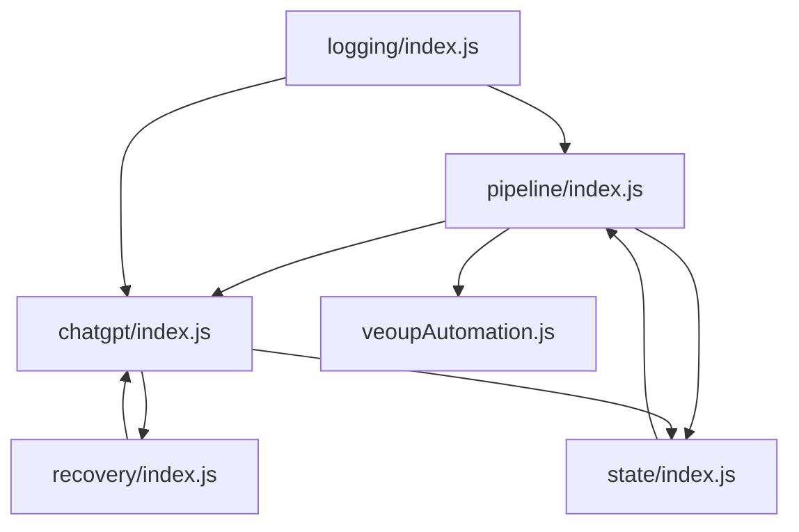

# Dependency Report

This report catalogs the global state, event listeners, IPC endpoints, function groups, and modular dependency risks inside `electron/main.js`.

---

## Global Variables

### `globalThis` Properties
These properties are set on the global context and accessible across any modules:

1. `globalThis.chatGptSendStates` (Map): Tracks ChatGPT message send state for each scene ID.
2. `globalThis.__vidoraLastCdpFallbackConsoleAt` (Number): Timestamp tracking last CDP Object Reference fallback log to throttle spam.
3. `globalThis.__vidoraActiveActionLock` (String): Mutex-like lock identifier preventing concurrent page reloads during active ChatGPT operations.
4. `globalThis.__vidoraPendingAction` (String): Active action flag protecting page reload.
5. `globalThis.__vidoraLastComposerState` (String): Tracks last known state of ChatGPT composer (e.g., empty, draft, generating).
6. `globalThis.__vidoraSafeExitRotationScheduled` (Boolean): Flag indicating if conversation rotation has been scheduled upon scene completion.
7. `globalThis.__vidoraLastProcessedSceneId` (String|Number): Scene ID currently under processing.
8. `globalThis.activeConversationUrl` (String): Current active thread conversation URL.
9. `globalThis.currentThreadId` (String): Current active ChatGPT thread ID.
10. `globalThis.__vidoraDisableSidebarSelection` (Boolean): Locks sidebar interaction in the browser during new conversation rotations.
11. `globalThis.__vidoraChatGptNewChatMode` (Boolean): Flag to skip history-touching recovery loops in a new conversation.
12. `globalThis.__vidoraPendingChatRenameTitleSafe` (String): Target conversation title pending safe rename.
13. `globalThis.__vidoraFreshChatCreatedForProject` (String): Unique identifier tracking new chats created per project session.
14. `globalThis.activeCdpClient` (Object): Reference to active chrome-remote-interface client.
15. `globalThis.__vidoraLogThrottle` (Object): Caches timestamps of logged entries to throttle log spam.
16. `globalThis.__vidoraLastValidProjectPath` (String): Cached path of the last valid project file used as a global fallback.
17. `globalThis.__vidoraLastProjectName` (String): Cached last project name.
18. `globalThis.__vidoraCdpCrashedOom` (Boolean): Set to true if a CDP crash occurs due to out-of-memory.
19. `globalThis.__vidoraCurrentActiveSceneId` (Number): Tracks current scene ID being built or prefetched.

### Module-Scope Global State
Variables defined at the module root of `electron/main.js` that act as shared state:

1. `chromeProcess` (ChildProcess): Reference to the launched Chromium debug instance.
2. `showPipelineLog` (Boolean): Toggle visibility of backend automation log messages.
3. `chatGptSceneOrdinal` (Number): Tracks sequence number of scenes processed in current run.
4. `sessionSceneCounter` (Number): Tracks total scenes run in active session.
5. `isChatGptContextFresh` (Boolean): True if chat context is newly created or reset.
6. `pipelineRunScope` (AsyncLocalStorage): Stores active execution context metadata (like `runId`).
7. `pipelineCancellation` (Object): Tracks active/cancelled pipeline run IDs, active reject hooks, and child processes.
8. `scenePipelineFailureTracker` (Object): Map of `sceneId` to consecutive failure counts.
9. `challengeRecoveryAttempts` (Map): Attempts count for Cloudflare/credential challenges.
10. `motionPromptSendLocks` (Map): Mutexes for motion prompt CDP operations.
11. `chatGptScenePrefetchLocks` (Map): Mutexes preventing duplicate scene pre-fetches.
12. `scenePipelineLocks` (Map): Scene concurrency execution locks.
13. `chatTitleStableChecks` (Map): Map of verification status of chat titles.

---

## IPC Handlers

### Electron `ipcMain` Registrations

All communication between the React/Renderer UI and Electron uses:
- `ipcMain.handle("channel", handler)`

No `ipcMain.on` listeners are present.

| IPC Channel | Handler Function | Purpose |
|---|---|---|
| `veoup:get-coordinate-config` | `getVeoUpCoordinateConfigHandler` | Retrieve saved mouse/keyboard click coordinate offsets for VeoUp automation. |
| `veoup:start-coordinate-setup` | `startVeoUpCoordinateSetupHandler` | Enter interactive cursor positioning mode to record VeoUp buttons. |
| `veoup:capture-coordinate` | `captureVeoUpCoordinateHandler` | Record single cursor coordinates. |
| `veoup:delete-coordinate-config` | `deleteVeoUpCoordinateConfigHandler`| Clear coordinate calibrations. |
| `veoup:save-coordinate-config` | `saveVeoUpCoordinateConfigHandler` | Commit coordinate offsets to JSON storage. |
| `veoup:cancel-coordinate-setup` | `cancelVeoUpCoordinateSetupHandler` | Exit calibration mode. |
| `veoup:scan-project-and-run` | `scanProjectAndRunVeoUpHandler` | Parse project tree, calibrate, and trigger VeoUp clicks. |
| `app:append-log` | `appendAppLog` | Write structured logs from UI to backend stream log file. |
| `app:get-log-path` | `getAppLogPath` | Returns the absolute path of `ai-video-pipeline.log`. |
| `prompt:open-hard-file` | `openHardPromptFile` | Open prompt configuration text file in external editor. |
| `prompt:get-hard-file` | `getHardPromptFileInfo` | Check existence and details of `2 NHIỆM VỤ BẰNG PROMPT.txt`. |
| `prompt:choose-hard-file` | `chooseHardPromptFile` | Opens system dialog to import prompt template text files. |
| `router:open-grok-folder` | `openGrokRouterFolder` | Reveal Grok credentials routing directory in File Explorer. |
| `router:get-status` | `getGrokRouterStatus` | Read current router enabled/disabled status and accounts list. |
| `router:list-accounts-safe` | `listGrokAccountsSafe` | Returns list of Grok accounts without credential secrets. |
| `router:select-account` | `selectGrokAccount` | Switch active routing target to specified account ID. |
| `router:set-enabled` | `setAccountRouterEnabled` | Enable or disable multi-account Grok router. |
| `router:resume-checkpoint` | `resumeFromRouterCheckpoint` | Rehydrate state from a router run checkpoint. |
| `accounts:list-safe` | `listWebAccountsSafe` | Returns decrypted web accounts credentials without secrets. |
| `accounts:save` | `saveWebAccount` | Securely encrypt and save account passwords/cookies. |
| `accounts:delete` | `deleteWebAccount` | Deletes stored credentials key from secure storage. |
| `view:get-pipeline-log-visible` | `getPipelineLogVisibility` | Query if backend log stream should be rendered in UI. |
| `browser:open-login` | `openWebLogin` | Launches visible browser window for manual login verification. |
| `browser:check-login` | `checkWebLogin` | Evaluates if credentials session cookie/profile is active. |
| `browser:send-prompt` | `sendPromptViaWeb` | Direct CDP prompt execution wrapper. |
| `pipeline:run-scene` | `runScenePipeline` | Core orchestration entry point for a single scene cycle. |
| `pipeline:stop` | `stopPipeline` | Force cancel active scene processes, scripts, and waits. |
| `output:choose-folder` | `chooseOutputFolder` | Native dialog for selecting output directories. |
| `project:choose-root-folder` | `chooseProjectRootFolder` | Select and initialize a new project workspace directory. |
| `folder:choose` | `chooseFolder` | General folder selector dialog. |
| `folder:scan` | `scanFolder` | Scans workspace directory for existing images, videos, frames. |
| `video:extract-last-frame` | `extractLastFrame` | Extract final frame image from a target video. |
| `video:merge` | `mergeVideos` | Concatenate generated scene videos into preview output. |
| `video:export-final` | `exportFinalVideo` | Packages merged output as official video export. |
| `image:copy-to-clipboard` | `copyImageToClipboard` | Writes native image buffer to clipboard. |
| `asset:exists` | `checkAssetExists` | Check file existence. |
| `asset:stat` | `getAssetStat` | Return file size and creation time. |
| `frame:get-previous` | `getPreviousFrame` | Retrieve the reference frame from previous scene. |
| `ai:split-prompt` | `splitPromptWithAI` | Request ChatGPT parser to break down scene paragraphs. |
| `ai:generate-scene-prompts` | `generateScenePrompts` | Request ChatGPT generation for image/motion prompts. |
| `project:export` | `exportProject` | Package project assets into zipped `.grokpkg` formats. |
| `project:new-session` | `newProjectSession` | Checks dirty state and resets project model session. |
| `project:save-session-file` | `saveProjectSessionFile` | Encodes and saves base64 assets to `.vdra` files. |
| `project:overwrite-session-file` | `overwriteProjectSessionFile`| Save `.vdra` directly to current filepath. |
| `project:create-session-file` | `createProjectSessionFile` | Initialize new `.vdra` structure. |
| `project:open-session-file` | `openProjectSessionFile` | Reads `.vdra` and restores embedded files. |
| `project:ensure-scene-folders` | `ensureProjectSceneFolders` | Prepares directory structure on disk for scenes. |
| `veoup:run-automation` | `runVeoUpAutomation` | Execute local VeoUp executable automation flow. |

### BrowserWindow Events
1. `win.on("closed")`: Tracks closing events of helper browser tabs/windows to prune references in `webWindows`.

### CDP / Chrome Remote Interface Events
1. `client.on("disconnect")`: Tracks termination of debug socket to reset active CDP clients.
2. `client.on("Network.responseReceived")`: Hooked during ChatGPT image capture loops to capture image asset signatures.
3. `client.on("Network.loadingFinished")`: Used to detect resource downloads during automated interaction.

### Process & Application Lifetime Events
1. `process.on("uncaughtException")`: Captures fatal crashes to write crash reports.
2. `process.on("unhandledRejection")`: Logs unhandled promise rejections.
3. `process.on("exit")` & `process.on("beforeExit")`: Executes cleanup on exit.
4. `app.on("before-quit")`, `app.on("will-quit")`, `app.on("quit")`, `app.on("window-all-closed")`: Native desktop lifecycles.
5. `app.on("browser-window-created")`: Global hook registering crash and closed monitors on every Electron window.
6. `app.on("web-contents-created")`: Registers navigation, crash, and unresponsive handlers on Chromium web contents.

---

## Major Function Groups

The main codebase is grouped into the following functional domains:

1. **Pipeline**: Concurrency control, orchestrating runs, coordinating scene lifecycles (`runScenePipeline`, `runScenePipelineLockedInternal`, `stopPipeline`).
2. **ChatGPT**: Automation scripts, send-ladders, CDP injections, paste actions, and image generation waits.
3. **Recovery**: UI recovery actions, Cloudflare recovery checks, and page reload handling (`recoverChatGptBlockingUi`, `performDurableRecovery`).
4. **Hydration**: Re-uploading keyframes, prompting historical context to a fresh session chat (`hydrateFreshChatGptContextAfterRotation`).
5. **Image**: Canvas checks, downloading base64 assets, and decoding buffers.
6. **Motion**: Generating motion text coordinates, formatting prompts, and matching schema.
7. **VeoUp**: Launching VeoUp processes, coordinate mapping, and clicking buttons.
8. **Memory**: Monitoring page heaps, logging milestones, and garbage collection flags (`checkProactiveMemoryGuard`).
9. **Logging**: Writing logs to disk and forwarding console wrappers.
10. **Utilities**: File path validations, duration checking, and ffmpeg integrations.

---

## Function Count

- **Async Functions**: 222
- **Sync Functions / Helpers**: 198
- **Total Functions**: 420
- **Registered IPC Endpoints**: 51
- **Global / Shared Variables**: 34 (19 on `globalThis`, 15 in module scope)

---

## Circular Dependency Risk

When dividing the monolithic `main.js` into sub-modules, there is a risk of circular dependencies:

### Analysis of Circular Links

1. **ChatGPT Automation & Recovery (`chatgpt` <-> `recovery`)**:
   - `chatgpt` executes prompt scripts, paste actions, and monitors response boxes.
   - If an error is detected, `chatgpt` triggers `recovery` handlers (e.g. `recoverChatGptBlockingUi`).
   - The recovery handler needs to call back into `chatgpt` functions (e.g., clearing the composer, forcing a submit, or rotating the chat).
   - *Risk*: Strict loop of mutual imports.
   - *Mitigation*: Export recovery utilities as pure helpers, pass the active execution client/controller as parameters, or bundle automation and recovery in a unified namespace.

2. **Pipeline orchestration & State Sync (`pipeline` <-> `state`)**:
   - `pipeline` modifies and updates scene states in the project.
   - `state` keeps tracks of running scenes, checks locks, and updates journals.
   - `state` sometimes needs to check cancellation states managed in the pipeline.
   - *Mitigation*: Ensure state is a leaf dependency that stores raw variables, and coordinate mutations solely inside the pipeline module.

3. **Logging & Operations (`logging` <-> `chatgpt` / `pipeline`)**:
   - Every file needs to log events.
   - `logging` requires application configuration or session contexts to write formatted entries.
   - *Mitigation*: Ensure `logging` is a clean utility leaf module. It should not depend on other modules; instead, they pass exact strings or structured data to `logging`.
