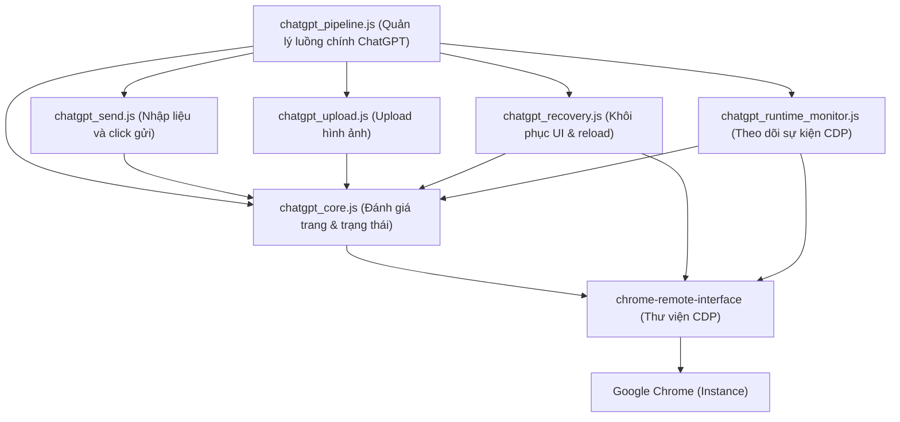

# Browser Automation Dependency Graph

Tài liệu này mô tả sơ đồ phụ thuộc giữa các module trong hệ thống tự động hóa trình duyệt của Vidora trước khi tiến hành migration sang Playwright.

## 1. Sơ đồ luồng điều khiển chính (Control & Automation Flow)

Sơ đồ thể hiện luồng đi từ Pipeline chính đến việc kiểm soát trình duyệt qua CDP:



## 2. Luồng IPC từ Renderer (UI) đến Trình duyệt

Sơ đồ thể hiện cách Renderer điều khiển tiến trình Chrome thông qua Electron IPC:

```mermaid
graph TD
    renderer["renderer.js (UI / Render Process)"]
    ipc["ipcMain (Main Process IPC)"]
    main["main.js (Main Process)"]
    chrome_remote_interface["chrome-remote-interface"]
    chrome["Google Chrome"]

    renderer -->|IPC: run-pipeline / start-chatgpt| ipc
    ipc --> main
    main -->|getCdpPage() / ensureChromeDebug()| chrome_remote_interface
    chrome_remote_interface --> chrome
```

## 3. Phạm vi ảnh hưởng (Impact Scope)

Khi thay thế thư viện `chrome-remote-interface` bằng `playwright-core`, các module sau chịu ảnh hưởng trực tiếp:
- **`main.js`**: Trực tiếp quản lý vòng đời trình duyệt Chrome (khởi chạy, đóng, dọn tab).
- **`chatgpt_core.js`**: Module lõi thực thi scripts (`evaluateOnCdpPage`).
- **`chatgpt_send.js`**: Điền text prompt, giả lập sự kiện bàn phím và click nút gửi.
- **`chatgpt_upload.js`**: Thao tác file chooser và gắn ảnh keyframe.
- **`chatgpt_runtime_monitor.js`**: Bắt các sự kiện mạng và binding console.
- **`chatgpt_recovery.js`**: Kích hoạt phím bấm ESC và reload trang khi gặp lỗi.
