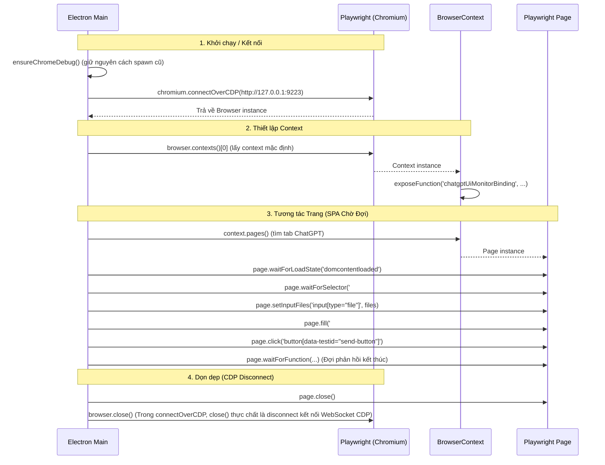

# Browser Automation Lifecycle

Tài liệu này mô tả chi tiết vòng đời hoạt động của trình duyệt từ lúc bắt đầu chạy pipeline cho đến khi dừng hoàn toàn.

## 1. Vòng đời hiện tại với CDP

Hiện tại, việc quản lý Chrome được thực hiện thông qua việc spawn một tiến trình độc lập và kết nối qua CDP:

```mermaid
sequenceDiagram
    participant App as Electron Main
    participant Chrome as Chrome Executable
    participant CDP as chrome-remote-interface
    participant Page as Web Page (ChatGPT)

    Note over App, Chrome: 1. Khởi chạy Trình duyệt
    App->>App: ensureChromeDebug()
    App->>Chrome: spawn(chrome.exe, --remote-debugging-port=9223)
    App->>App: isChromeDebugReady() (loop fetch json/version)
    Chrome-->>App: HTTP 200 (Ready)

    Note over App, CDP: 2. Thiết lập Kết nối
    App->>CDP: CDP.List()
    CDP-->>App: Trả về danh sách Target/Tab
    App->>CDP: CDP({ target })
    CDP-->>App: Trả về CDP Client instance

    Note over App, Page: 3. Tương tác Trang
    App->>Page: Page.enable(), Runtime.enable(), DOM.enable(), Network.enable()
    App->>Page: evaluateOnCdpPage(document.readyState)
    App->>Page: setFileInputFiles() (Upload file)
    App->>Page: Input.insertText() (Nhập prompt)
    App->>Page: clickSendButton()

    Note over App, CDP: 4. Đóng / Khôi phục
    rect rgb(50, 20, 20)
        Note over App, Page: Trạng thái Lỗi / Crash
        App->>Page: recoverCdpPageIfCrashed() (reload)
    end
    App->>CDP: client.close()
    App->>Chrome: process.kill(pid) (Khi đóng ứng dụng)
```

## 2. Vòng đời mới đề xuất với Playwright

Sau khi chuyển đổi sang Playwright, vòng đời sẽ được trừu tượng hóa và quản lý bởi Playwright Context:

## 3. Điểm khác biệt quan trọng trong Vòng đời

1. **Quản lý Vòng đời Trình duyệt**:
   - **CDP cũ**: Quản lý port thô, fetch HTTP json endpoint để kiểm tra trạng thái mở/đóng tab.
   - **Playwright mới**: Sử dụng `browser.on('disconnected')` để lắng nghe trình duyệt đóng đột ngột, tự động làm sạch tài nguyên của tiến trình Node mà không để lại connection leak.
   - **Ngắt kết nối**: Do Playwright không cung cấp phương thức `disconnect()` công khai trên `Browser` class, chúng ta sẽ gọi **`browser.close()`** để ngắt kết nối WebSocket tới remote Chrome mà không làm tắt tiến trình Chrome thực tế của người dùng.
2. **Quản lý Tab / Page**:
   - **CDP cũ**: Cần gọi `openCdpTab` bằng PUT request thủ công qua fetch.
   - **Playwright mới**: Chỉ cần gọi `context.newPage()` hoặc làm việc với mảng `context.pages()`.
3. **Cơ chế chờ SPA**:
   - Tận dụng `page.waitForSelector()` và `page.waitForFunction()` của Playwright để xử lý chính xác đặc trưng thay đổi giao diện động bất đồng bộ của ChatGPT SPA, không lạm dụng `waitForLoadState()`.
