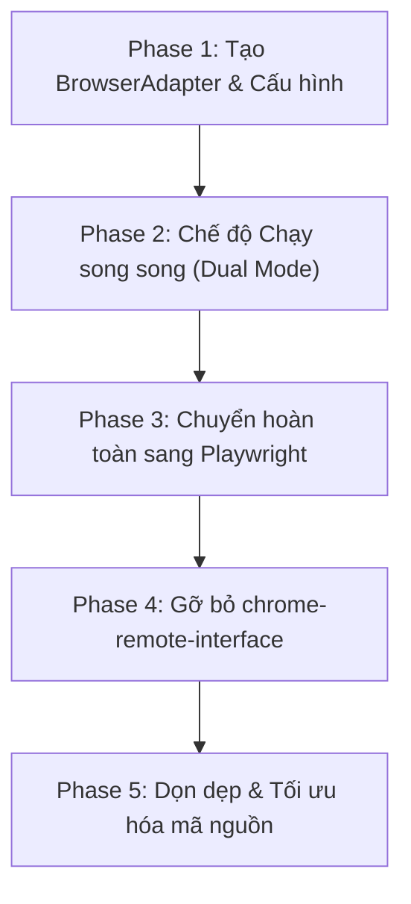

# Playwright Migration Plan

Kế hoạch chuyển đổi từng bước (Phase-by-Phase) lớp Browser Automation sang Playwright nhằm đảm bảo tính an toàn, giảm thiểu rủi ro lỗi và hỗ trợ rollback nhanh chóng.

## Luồng chuyển đổi tổng quát

---

## Chi tiết các Giai đoạn (Phases)

### Phase 1: Phát triển BrowserAdapter & Cài đặt Thư viện
- **Mục tiêu**: Cài đặt `playwright-core` vào `package.json` và xây dựng lớp `BrowserAdapter` hỗ trợ cả 2 driver (CDP và Playwright).
- **Các bước thực hiện**:
  1. Chạy `npm install playwright-core --save`.
  2. Tạo file `electron/main/chatgpt/browser_adapter.js` triển khai lớp `BrowserAdapter`.
  3. Đảm bảo cấu hình dự án không bị lỗi cú pháp (`npm run dev` chạy bình thường).

### Phase 2: Chế độ Chạy song song (Dual Mode)
- **Mục tiêu**: Cho phép chuyển đổi linh hoạt giữa CDP và Playwright thông qua cấu hình môi trường hoặc biến cờ.
- **Các bước thực hiện**:
  1. Định nghĩa cờ cấu hình `BROWSER_AUTOMATION_PROVIDER` trong file `.env` hoặc file cấu hình (các giá trị có thể là: `cdp` hoặc `playwright`).
  2. Điều chỉnh hàm `getCdpPage()` để trả về thực thể `BrowserAdapter`.
  3. Cập nhật các hàm trong `chatgpt_core.js`, `chatgpt_send.js`, `chatgpt_upload.js` để gọi phương thức của `BrowserAdapter` thay vì gọi trực tiếp API CDP.
  4. **Quan trọng**: Giữ nguyên wrapper thực thi JS (`evaluateOnCdpPage` / `evaluate`) để phục vụ cả 2 driver và tránh các lỗi chuyển giao dữ liệu.
  5. Thực hiện chạy thử nghiệm với `BROWSER_AUTOMATION_PROVIDER=cdp` để kiểm tra khả năng tương thích ngược.

### Phase 3: Chuyển đổi Hoàn toàn sang Playwright Driver
- **Mục tiêu**: Đặt mặc định driver là Playwright và tiến hành sửa lỗi trong quá trình chạy thực tế.
- **Các bước thực hiện**:
  1. Cấu hình mặc định `BROWSER_AUTOMATION_PROVIDER=playwright`.
  2. **Quản lý vòng đời**: Qua audit mã nguồn Playwright, đối tượng `Browser` không có hàm `disconnect()`. Khi gọi `browser.close()` trên đối tượng có được từ `connectOverCDP`, Playwright tự động giải phóng tài nguyên và ngắt kết nối WebSocket mà không tắt Chrome của người dùng. Áp dụng `browser.close()` làm cơ chế ngắt kết nối.
  3. **Cơ chế chờ của SPA**: Sử dụng `page.waitForSelector()` hoặc `page.waitForFunction()` và theo dõi trạng thái monitor thay vì chỉ gọi `waitForLoadState()`, nhằm xử lý chính xác đặc thù bất đồng bộ của ứng dụng SPA (như ChatGPT).
  4. Tinh chỉnh các tham số chờ (timeouts, delays) của Playwright cho khớp với các thao tác tự nhiên của con người.

### Phase 4: Gỡ bỏ Thư viện `chrome-remote-interface`
- **Mục tiêu**: Làm sạch các dependencies của dự án.
- **Các bước thực hiện**:
  1. Gỡ bỏ `chrome-remote-interface` khỏi `package.json`.
  2. Chạy `npm uninstall chrome-remote-interface` và `npm prune`.
  3. Xóa các đoạn mã fallback hoặc driver CDP cũ trong `BrowserAdapter`.

### Phase 5: Tối ưu hóa mã nguồn & Dọn dẹp DOM Scripts
- **Mục tiêu**: Rút gọn mã nguồn bằng cách loại bỏ các DOM scripts tự viết trước đây.
- **Các bước thực hiện**:
  1. Loại bỏ các hàm giả lập sự kiện phím bấm phức tạp trong `chatgpt_dom.js` và `chatgpt_send.js` không cần thiết.
  2. Đảm bảo vẫn duy trì wrapper evaluate an toàn để giải quyết các cấu trúc tham chiếu phức tạp khi cần thiết.
  3. Chạy lại toàn bộ regression checklist.
