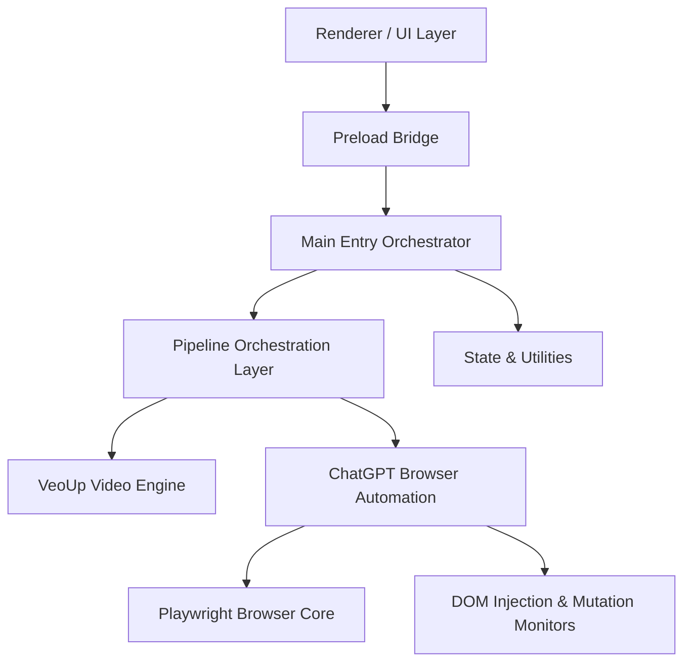

# Architecture Map & System Modules

## Architectural Layers

### 1. UI / Renderer Layer (`electron/renderer.js`, `electron/index.html`)
* **Responsibility**: Provides the user interface, renders scene templates, controls step transitions, and communicates with the Main process via the Preload bridge.

### 2. Preload Bridge (`electron/preload.js`)
* **Responsibility**: Exposes safe, restricted IPC APIs to the renderer window to prevent raw Node/Electron module access in UI context.

### 3. Main Orchestrator (`electron/main.js`, `electron/main/index.js`)
* **Responsibility**: Boots the application, configures global IPC listeners, manages Electron window lifecycle, and manages Chrome browser profiles.

### 4. Pipeline Layer (`electron/main/pipeline/pipeline_runner.js`)
* **Responsibility**: Orchestrates the closed-loop production lifecycle (ChatGPT image generation -> VeoUp video processing -> extraction of continuity final frame -> next scene loop).

### 5. ChatGPT Browser Automation (`electron/main/chatgpt/*`)
* **Responsibility**: Automates ChatGPT web actions (prompts, uploads, waiting states, login recovery, runtime DOM mutation observation).

### 6. VeoUp Video Automation (`electron/main/veoup/veoup.js`)
* **Responsibility**: Drives VeoUp local app automation to compile prompt keyframes into production videos.

### 7. Core Utilities & State (`electron/main/state/*`, `electron/main/utils/*`, `electron/main/logging/*`)
* **Responsibility**: Manages application state, project config, path resolution, and logging.

## Module Responsibilities

### Module `electron/main.js`
* **What it owns**: App bootstrap and Electron main process entry point.
* **What it should never do**: Never violate structural architecture boundaries.
* **Cohesion**: High (focused on single conceptual domain).
* **Dependencies**: `child_process`, `electron/main/logging/index.js`, `electron/main/utils/index.js`, `electron/main/memory/index.js`, `electron/main/state/index.js`, `electron/main/state/chatgpt_state.js`, `electron/main/chatgpt/chatgpt_dom.js`, `electron/main/chatgpt/chatgpt_core.js`, `electron/main/chatgpt/browser_adapter.js`, `electron/main/chatgpt/chatgpt_upload.js`, `electron/main/chatgpt/chatgpt_send.js`, `electron/main/chatgpt/chatgpt_recovery.js`, `electron/main/bootstrap/index.js`, `electron/main/ipc/index.js`, `electron/main/chatgpt/index.js`, `electron/main/recovery/index.js`, `electron`, `ffmpeg-static`, `fs/promises`, `path`, `crypto`, `async_hooks`, `electron/main/veoup/index.js`, `electron/main/pipeline/index.js`, `./chatgptStability`, `fs`, `chrome-remote-interface`

### Module `electron/preload.js`
* **What it owns**: IPC bridge between Main and Renderer processes.
* **What it should never do**: Never expose raw Node.js API or `require` to the window context.
* **Cohesion**: High (focused on single conceptual domain).
* **Dependencies**: `electron`

### Module `electron/renderer.js`
* **What it owns**: Main UI behavior and orchestration.
* **What it should never do**: Never violate structural architecture boundaries.
* **Cohesion**: High (focused on single conceptual domain).
* **Dependencies**: *None*

### Module `electron/main/index.js`
* **What it owns**: Main exports rollup.
* **What it should never do**: Never violate structural architecture boundaries.
* **Cohesion**: High (focused on single conceptual domain).
* **Dependencies**: `electron/main/chatgpt/index.js`, `electron/main/pipeline/index.js`, `electron/main/recovery/index.js`, `electron/main/state/index.js`, `electron/main/utils/index.js`, `electron/main/logging/index.js`, `electron/main/memory/index.js`

### Module `electron/main/bootstrap/index.js`
* **What it owns**: Bootstrap module rollup.
* **What it should never do**: Never violate structural architecture boundaries.
* **Cohesion**: High (focused on single conceptual domain).
* **Dependencies**: `electron/main/bootstrap/bootstrap.js`

### Module `electron/main/bootstrap/bootstrap.js`
* **What it owns**: Application directory and files initialization.
* **What it should never do**: Never violate structural architecture boundaries.
* **Cohesion**: High (focused on single conceptual domain).
* **Dependencies**: *None*

### Module `electron/main/chatgpt/index.js`
* **What it owns**: ChatGPT module rollup.
* **What it should never do**: Never violate structural architecture boundaries.
* **Cohesion**: High (focused on single conceptual domain).
* **Dependencies**: `electron/main/chatgpt/chatgpt_core.js`, `electron/main/chatgpt/chatgpt_dom.js`, `electron/main/chatgpt/chatgpt_send.js`, `electron/main/chatgpt/chatgpt_upload.js`, `electron/main/chatgpt/chatgpt_recovery.js`, `electron/main/chatgpt/chatgpt_pipeline.js`, `electron/main/chatgpt/chatgpt_runtime_monitor.js`, `electron/main/chatgpt/chatgpt_pipeline_adapter.js`

### Module `electron/main/chatgpt/browser_adapter.js`
* **What it owns**: Abstraction for Playwright / CDP browser instances.
* **What it should never do**: Never violate structural architecture boundaries.
* **Cohesion**: High (focused on single conceptual domain).
* **Dependencies**: `electron/main/logging/index.js`, `playwright-core`

### Module `electron/main/chatgpt/chatgpt_core.js`
* **What it owns**: Core evaluate wrapper for browser integration.
* **What it should never do**: Never violate structural architecture boundaries.
* **Cohesion**: High (focused on single conceptual domain).
* **Dependencies**: `electron/main/logging/index.js`, `electron/main/utils/index.js`, `electron/main/chatgpt/chatgpt_dom.js`

### Module `electron/main/chatgpt/chatgpt_dom.js`
* **What it owns**: ChatGPT DOM selector mappings and mutation monitors.
* **What it should never do**: Never violate structural architecture boundaries.
* **Cohesion**: High (focused on single conceptual domain).
* **Dependencies**: *None*

### Module `electron/main/chatgpt/chatgpt_pipeline.js`
* **What it owns**: ChatGPT orchestration pipeline for prompting, images, and motion.
* **What it should never do**: Never bypass the sequential scene order or run parallel keyframe processing.
* **Cohesion**: High (focused on single conceptual domain).
* **Dependencies**: `electron`, `fs/promises`, `path`, `electron/main/chatgpt/chatgpt_runtime_monitor.js`, `electron/main/chatgpt/chatgpt_pipeline_adapter.js`, `electron/main/logging/index.js`, `electron/main/utils/index.js`, `electron/main/memory/index.js`, `electron/main/state/index.js`, `electron/main/state/chatgpt_state.js`, `electron/main/chatgpt/chatgpt_dom.js`, `electron/main/chatgpt/chatgpt_core.js`, `electron/main/chatgpt/chatgpt_send.js`, `electron/main/chatgpt/chatgpt_upload.js`, `../../chatgptStability`, `electron/main/chatgpt/chatgpt_recovery.js`, `electron/main/recovery/index.js`, `electron/main/chatgpt/chatgpt_pipeline_adapter.js`, `electron/main/chatgpt/chatgpt_runtime_monitor.js`

### Module `electron/main/chatgpt/chatgpt_pipeline_adapter.js`
* **What it owns**: Adapter between pipeline and browser pages.
* **What it should never do**: Never violate structural architecture boundaries.
* **Cohesion**: High (focused on single conceptual domain).
* **Dependencies**: *None*

### Module `electron/main/chatgpt/chatgpt_recovery.js`
* **What it owns**: ChatGPT login and tab recovery flows.
* **What it should never do**: Never violate structural architecture boundaries.
* **Cohesion**: High (focused on single conceptual domain).
* **Dependencies**: `electron/main/logging/index.js`, `electron/main/utils/index.js`, `electron/main/chatgpt/chatgpt_core.js`, `electron/main/chatgpt/chatgpt_dom.js`, `electron/main/chatgpt/chatgpt_upload.js`, `electron/main/chatgpt/chatgpt_send.js`, `electron/main/state/index.js`, `electron/main/state/chatgpt_state.js`, `chrome-remote-interface`

### Module `electron/main/chatgpt/chatgpt_runtime_monitor.js`
* **What it owns**: Monitors ChatGPT page actions in real-time.
* **What it should never do**: Never violate structural architecture boundaries.
* **Cohesion**: High (focused on single conceptual domain).
* **Dependencies**: `events`, `electron/main/logging/index.js`, `electron/main/chatgpt/chatgpt_dom.js`

### Module `electron/main/chatgpt/chatgpt_send.js`
* **What it owns**: Handles textual typing and input submission to ChatGPT.
* **What it should never do**: Never violate structural architecture boundaries.
* **Cohesion**: High (focused on single conceptual domain).
* **Dependencies**: `electron/main/logging/index.js`, `electron/main/utils/index.js`, `electron/main/state/index.js`, `electron/main/chatgpt/chatgpt_core.js`, `electron/main/chatgpt/chatgpt_dom.js`, `electron/main/chatgpt/chatgpt_runtime_monitor.js`, `electron/main/chatgpt/chatgpt_runtime_monitor.js`

### Module `electron/main/chatgpt/chatgpt_upload.js`
* **What it owns**: Manages image/attachment uploading in ChatGPT composer.
* **What it should never do**: Never violate structural architecture boundaries.
* **Cohesion**: High (focused on single conceptual domain).
* **Dependencies**: `path`, `electron/main/logging/index.js`, `electron/main/utils/index.js`, `electron/main/chatgpt/chatgpt_dom.js`, `electron/main/chatgpt/chatgpt_core.js`

### Module `electron/main/chatgpt/debug.js`
* **What it owns**: Helper for debug prints and session logs.
* **What it should never do**: Never violate structural architecture boundaries.
* **Cohesion**: High (focused on single conceptual domain).
* **Dependencies**: `playwright`, `repl`

### Module `electron/main/ipc/index.js`
* **What it owns**: IPC module rollup.
* **What it should never do**: Never violate structural architecture boundaries.
* **Cohesion**: High (focused on single conceptual domain).
* **Dependencies**: `electron/main/ipc/ipc_handlers.js`

### Module `electron/main/ipc/ipc_handlers.js`
* **What it owns**: IPC listener registry and message routing.
* **What it should never do**: Never violate structural architecture boundaries.
* **Cohesion**: High (focused on single conceptual domain).
* **Dependencies**: *None*

### Module `electron/main/logging/index.js`
* **What it owns**: Logging module rollup.
* **What it should never do**: Never violate structural architecture boundaries.
* **Cohesion**: High (focused on single conceptual domain).
* **Dependencies**: `electron/main/logging/logging.js`

### Module `electron/main/logging/logging.js`
* **What it owns**: File-based and console application logger.
* **What it should never do**: Never violate structural architecture boundaries.
* **Cohesion**: High (focused on single conceptual domain).
* **Dependencies**: `electron`, `fs/promises`, `fs`, `path`

### Module `electron/main/memory/index.js`
* **What it owns**: Memory module rollup.
* **What it should never do**: Never violate structural architecture boundaries.
* **Cohesion**: High (focused on single conceptual domain).
* **Dependencies**: `electron/main/memory/memory.js`

### Module `electron/main/memory/memory.js`
* **What it owns**: Tracks memory utilization to avoid memory leaks.
* **What it should never do**: Never violate structural architecture boundaries.
* **Cohesion**: High (focused on single conceptual domain).
* **Dependencies**: `electron`, `electron/main/logging/index.js`

### Module `electron/main/pipeline/index.js`
* **What it owns**: Pipeline module rollup.
* **What it should never do**: Never violate structural architecture boundaries.
* **Cohesion**: High (focused on single conceptual domain).
* **Dependencies**: `electron/main/pipeline/pipeline_runner.js`

### Module `electron/main/pipeline/pipeline_runner.js`
* **What it owns**: Closed-loop pipeline orchestrator running the main loop.
* **What it should never do**: Never proceed to Scene N+1 if the current scene video is not fully compiled and verified.
* **Cohesion**: High (focused on single conceptual domain).
* **Dependencies**: `electron`, `async_hooks`, `fs/promises`, `path`, `electron/main/logging/index.js`, `electron/main/utils/index.js`, `electron/main/recovery/index.js`, `electron/main/memory/index.js`, `electron/main/state/index.js`, `electron/main/state/chatgpt_state.js`, `electron/main/chatgpt/index.js`, `electron/main/veoup/index.js`, `../../chatgptStability`

### Module `electron/main/recovery/index.js`
* **What it owns**: Recovery module rollup.
* **What it should never do**: Never violate structural architecture boundaries.
* **Cohesion**: High (focused on single conceptual domain).
* **Dependencies**: `electron/main/recovery/recovery.js`

### Module `electron/main/recovery/recovery.js`
* **What it owns**: Durable recovery logic for application-wide crashes.
* **What it should never do**: Never violate structural architecture boundaries.
* **Cohesion**: High (focused on single conceptual domain).
* **Dependencies**: `electron/main/logging/index.js`

### Module `electron/main/state/index.js`
* **What it owns**: State module rollup.
* **What it should never do**: Never violate structural architecture boundaries.
* **Cohesion**: High (focused on single conceptual domain).
* **Dependencies**: `electron/main/state/state.js`

### Module `electron/main/state/chatgpt_state.js`
* **What it owns**: Isolated state for ChatGPT session tracking.
* **What it should never do**: Never violate structural architecture boundaries.
* **Cohesion**: High (focused on single conceptual domain).
* **Dependencies**: *None*

### Module `electron/main/state/state.js`
* **What it owns**: Centralized runtime project and application state.
* **What it should never do**: Never violate structural architecture boundaries.
* **Cohesion**: High (focused on single conceptual domain).
* **Dependencies**: `fs/promises`, `path`, `electron/main/utils/index.js`

### Module `electron/main/utils/index.js`
* **What it owns**: Utilities rollup.
* **What it should never do**: Never violate structural architecture boundaries.
* **Cohesion**: High (focused on single conceptual domain).
* **Dependencies**: `electron/main/utils/utils.js`

### Module `electron/main/utils/utils.js`
* **What it owns**: Utility functions for paths, file I/O, and sleep.
* **What it should never do**: Never violate structural architecture boundaries.
* **Cohesion**: High (focused on single conceptual domain).
* **Dependencies**: `electron`, `ffmpeg-static`, `fs/promises`, `path`, `electron/main/logging/index.js`

### Module `electron/main/veoup/index.js`
* **What it owns**: VeoUp module rollup.
* **What it should never do**: Never violate structural architecture boundaries.
* **Cohesion**: High (focused on single conceptual domain).
* **Dependencies**: `electron/main/veoup/veoup.js`

### Module `electron/main/veoup/veoup.js`
* **What it owns**: VeoUp desktop app automation.
* **What it should never do**: Never import or rely on Grok/ChatGPT browser instances.
* **Cohesion**: High (focused on single conceptual domain).
* **Dependencies**: `fs`, `fs/promises`, `os`, `path`, `child_process`, `electron`, `electron/main/logging/index.js`

## Circular Dependencies

No circular dependencies detected.

## Dead Code

### Exported but Unused Functions
* `sendPromptScript()` in `electron/main/chatgpt/chatgpt_dom.js`
* `clickSendButtonScript()` in `electron/main/chatgpt/chatgpt_dom.js`
* `inspectAndClickChatGptSendButtonSafely()` in `electron/main/chatgpt/chatgpt_dom.js`
* `inspectAndClickChatGptSendButton()` in `electron/main/chatgpt/chatgpt_dom.js`
* `forceSubmitChatGptComposerScript()` in `electron/main/chatgpt/chatgpt_dom.js`
* `dispatchNv2ComposerInputEventsScript()` in `electron/main/chatgpt/chatgpt_dom.js`
* `clearNv2ComposerScript()` in `electron/main/chatgpt/chatgpt_dom.js`
* `deepFocusNv2ComposerScript()` in `electron/main/chatgpt/chatgpt_dom.js`
* `setPromptInputValueScript()` in `electron/main/chatgpt/chatgpt_dom.js`
* `focusPromptInputScript()` in `electron/main/chatgpt/chatgpt_dom.js`
* `detectLoginScript()` in `electron/main/chatgpt/chatgpt_dom.js`
* `detectBrowserCrashPageScript()` in `electron/main/chatgpt/chatgpt_dom.js`
* `dismissChatGptBlockingUiScript()` in `electron/main/chatgpt/chatgpt_dom.js`
* `detectChatGptResponseChoiceUiScript()` in `electron/main/chatgpt/chatgpt_dom.js`
* `detectChatGptActiveGenerationScript()` in `electron/main/chatgpt/chatgpt_dom.js`
* `detectChatGptActiveGenerationScriptStrict()` in `electron/main/chatgpt/chatgpt_dom.js`
* `getComposerTextScript()` in `electron/main/chatgpt/chatgpt_dom.js`
* `getActiveComposerTextScript()` in `electron/main/chatgpt/chatgpt_dom.js`
* `inspectNv2ComposerSubmitStateScript()` in `electron/main/chatgpt/chatgpt_dom.js`
* `clickChatGptStopGeneratingScript()` in `electron/main/chatgpt/chatgpt_dom.js`
* `detectUploadedAssetScript()` in `electron/main/chatgpt/chatgpt_dom.js`
* `clickUploadButtonScript()` in `electron/main/chatgpt/chatgpt_dom.js`
* `prepareChatGptCreateImageScript()` in `electron/main/chatgpt/chatgpt_dom.js`
* `readLatestAssistantScript()` in `electron/main/chatgpt/chatgpt_dom.js`
* `sanitizeAssetUrlForLog()` in `electron/main/chatgpt/chatgpt_pipeline.js`
* `tryExtractChatGptNetworkImage()` in `electron/main/chatgpt/chatgpt_pipeline.js`
* `chatGptImageCandidateSignature()` in `electron/main/chatgpt/chatgpt_pipeline.js`
* `countVisibleChatGptImageCandidates()` in `electron/main/chatgpt/chatgpt_pipeline.js`
* `hasVisibleChatGptImageCandidate()` in `electron/main/chatgpt/chatgpt_pipeline.js`
* `isLikelyChatGptLoadingPlaceholderImage()` in `electron/main/chatgpt/chatgpt_pipeline.js`
* `isPreferredChatGptRealImageAsset()` in `electron/main/chatgpt/chatgpt_pipeline.js`
* `isFalseChatGptImageGeneratingState()` in `electron/main/chatgpt/chatgpt_pipeline.js`
* `refreshChatGptPageBeforeImageExtract()` in `electron/main/chatgpt/chatgpt_pipeline.js`
* `waitForLatestChatGPTGeneratedImage()` in `electron/main/chatgpt/chatgpt_pipeline.js`
* `extractLatestChatGPTGeneratedImageBytes()` in `electron/main/chatgpt/chatgpt_pipeline.js`
* `collectGeneratedImageUrlsScript()` in `electron/main/chatgpt/chatgpt_pipeline.js`
* `checkExistingCompletedImageScript()` in `electron/main/chatgpt/chatgpt_pipeline.js`
* `ensureChatGptImageLoadedAndHydratedScript()` in `electron/main/chatgpt/chatgpt_pipeline.js`
* `getChatGptImageCandidateBoxScript()` in `electron/main/chatgpt/chatgpt_pipeline.js`
* `getLatestImageBoxScript()` in `electron/main/chatgpt/chatgpt_pipeline.js`
* `maybeRenameChatGptCurrentConversationUntilTitle()` in `electron/main/chatgpt/chatgpt_pipeline.js`
* `renameChatGptCurrentConversationUntilTitle()` in `electron/main/chatgpt/chatgpt_pipeline.js`
* `performDurableRecovery()` in `electron/main/chatgpt/chatgpt_recovery.js`
* `isLikelyChatGptSendButtonText()` in `electron/main/chatgpt/chatgpt_send.js`
* `forceClickChatGptComposerSubmit()` in `electron/main/chatgpt/chatgpt_send.js`
* `sendPromptViaCdpInputSingle()` in `electron/main/chatgpt/chatgpt_send.js`
* `focusNv2ComposerWithCdp()` in `electron/main/chatgpt/chatgpt_send.js`
* `vidoraClickChatGptRealSendButton()` in `electron/main/chatgpt/chatgpt_send.js`
* `vidoraClearChatGptInputBeforePaste()` in `electron/main/chatgpt/chatgpt_send.js`
* `__vidoraCompactConsoleArg()` in `electron/main/logging/logging.js`
* `getAppLogPath()` in `electron/main/logging/logging.js`
* `vidoraShouldThrottleLog()` in `electron/main/logging/logging.js`
* `getCdpPageMemoryMetrics()` in `electron/main/memory/memory.js`
* `runScenePipelineLocked()` in `electron/main/pipeline/pipeline_runner.js`
* `runScenePipelineLockedInternal()` in `electron/main/pipeline/pipeline_runner.js`
* `stopPipeline()` in `electron/main/pipeline/pipeline_runner.js`
* `cancelPipelineRun()` in `electron/main/pipeline/pipeline_runner.js`
* `prepareSceneContext()` in `electron/main/pipeline/pipeline_runner.js`
* `isVeoUpStageError()` in `electron/main/pipeline/pipeline_runner.js`
* `readPipelineSceneState()` in `electron/main/pipeline/pipeline_runner.js`
* `assertDurableSceneSuccess()` in `electron/main/pipeline/pipeline_runner.js`
* `isSceneScopedFilePath()` in `electron/main/pipeline/pipeline_runner.js`
* `startNextSceneChatGptPrefetch()` in `electron/main/pipeline/pipeline_runner.js`
* `imageFileToDataUrl()` in `electron/main/pipeline/pipeline_runner.js`
* `ensureContinuityReferencesForPreviousScene()` in `electron/main/pipeline/pipeline_runner.js`
* `buildContinuityPromptInstruction()` in `electron/main/pipeline/pipeline_runner.js`
* `appendContinuityGuidanceToMotionPrompt()` in `electron/main/pipeline/pipeline_runner.js`
* `maybeResetChatGptPageForLongRun()` in `electron/main/recovery/recovery.js`
* `maybeRotateChatGptConversation()` in `electron/main/recovery/recovery.js`
* `normalizeChatTitleValue()` in `electron/main/state/state.js`
* `normalizeChatGptPromptCompareText()` in `electron/main/state/state.js`
* `writeActionJournal()` in `electron/main/state/state.js`
* `readActionJournal()` in `electron/main/state/state.js`
* `isNv2SnapshotGenerationActive()` in `electron/main/state/state.js`
* `extractCompletedNv2ResponseFromSnapshot()` in `electron/main/state/state.js`
* `selectLatestCompletedAssistantMessage()` in `electron/main/state/state.js`
* `selectNewAssistantMessageAfterBaseline()` in `electron/main/state/state.js`
* `normalizeWhitespace()` in `electron/main/veoup/veoup.js`
* `collectKeyframes()` in `electron/main/veoup/veoup.js`
* `collectMotionPrompts()` in `electron/main/veoup/veoup.js`
* `convertVeoUpClientPointToScreen()` in `electron/main/veoup/veoup.js`
* `prepareVeoUpKeyframesFolder()` in `electron/main/veoup/veoup.js`
* `exportVeoUpPromptFile()` in `electron/main/veoup/veoup.js`
* `findVeoupExecutable()` in `electron/main/veoup/veoup.js`
* `scanProjectAndRunVeoUp()` in `electron/main/veoup/veoup.js`

### Unreachable Functions
* `resolveProjectPrepromptFolder()` in `electron/main.js`
* `importCharacterPresetsHandler()` in `electron/main.js`
* `newProjectSession()` in `electron/main.js`
* `saveProjectSessionFile()` in `electron/main.js`
* `openProjectSessionFile()` in `electron/main.js`
* `safeWebAccount()` in `electron/main.js`
* `saveWebAccount()` in `electron/main.js`
* `deleteWebAccount()` in `electron/main.js`
* `captureChatGptDiagnosticSnapshotScript()` in `electron/main.js`
* `resumeFromRouterCheckpoint()` in `electron/main.js`
* `getHardPromptFileInfo()` in `electron/main.js`
* `chooseHardPromptFile()` in `electron/main.js`
* `openHardPromptFile()` in `electron/main.js`
* `openGrokRouterFolder()` in `electron/main.js`
* `getPipelineLogVisibility()` in `electron/main.js`
* `chooseFolder()` in `electron/main.js`
* `collectFromDir()` in `electron/main.js`
* `extractLastFrameToPathHandler()` in `electron/main.js`
* `extractLastFrame()` in `electron/main.js`
* `copyImageToClipboard()` in `electron/main.js`
* `getPreviousFrame()` in `electron/main.js`
* `exportFinalVideo()` in `electron/main.js`
* `mergeVideoFiles()` in `electron/main.js`
* `splitPromptWithAI()` in `electron/main.js`
* `chooseProjectRootFolder()` in `electron/main.js`
* `clearProviderSession()` in `electron/main.js`
* `openFreshChatGptRootPage()` in `electron/main.js`
* `assertChatGptNotExistingConversation()` in `electron/main.js`
* `waitForGrokImagineReady()` in `electron/main.js`
* `forceGrokNormalImagineVideoMode()` in `electron/main.js`
* `closeGrokTemplateModal()` in `electron/main.js`
* `forceGrokNormalImagineMode()` in `electron/main.js`
* `collectExistingProjectVideos()` in `electron/main.js`
* `restoreProjectKeyframesToChatGPT()` in `electron/main.js`
* `clearGrokCanvasSelection()` in `electron/main.js`
* `waitForNewImageUrl()` in `electron/main.js`
* `captureLatestImageElement()` in `electron/main.js`
* `checkAssetExists()` in `electron/main.js`
* `getAssetStat()` in `electron/main.js`
* `pressEnterToSubmit()` in `electron/main.js`
* `downloadAssetInPageScript()` in `electron/main.js`
* `fillProviderLoginScript()` in `electron/main.js`
* `clickButton()` in `electron/main.js`
* `detectVideoCapabilityScript()` in `electron/main.js`
* `getPromptInputCandidates()` in `electron/main.js`
* `collectVideoUrlsScript()` in `electron/main.js`
* `detectGrokPageFailureScript()` in `electron/main.js`
* `getGrokReadyStateScript()` in `electron/main.js`
* `getGrokRouteStateScript()` in `electron/main.js`
* `detectGrokTemplateModalScript()` in `electron/main.js`
* `closeGrokTemplateModalScript()` in `electron/main.js`
* `getGrokTemplateViewportFallbackPointsScript()` in `electron/main.js`
* `scanGrokTemplateModalScript()` in `electron/main.js`
* `selectGrokPhotoVideoTemplateScript()` in `electron/main.js`
* `forceHideGrokTemplateModalScript()` in `electron/main.js`
* `prepareGrokVideoComposerScript()` in `electron/main.js`
* `clickExact()` in `electron/main.js`
* `preparePixVerseComposerScript()` in `electron/main.js`
* `setPixVersePromptScript()` in `electron/main.js`
* `setGrokComposerTextScript()` in `electron/main.js`
* `focusGrokComposerScript()` in `electron/main.js`
* `labelGrokCanvasScript()` in `electron/main.js`
* `clearGrokCanvasChatScript()` in `electron/main.js`
* `clickGrokUploadImageMenuItemScript()` in `electron/main.js`
* `clickGrokCanvasUploadImageScript()` in `electron/main.js`
* `focusGrokWorkspaceScript()` in `electron/main.js`
* `setGrokVideoPromptScript()` in `electron/main.js`
* `detectGrokConfirmationQuestionScript()` in `electron/main.js`
* `getGrokSendPreflightScript()` in `electron/main.js`
* `boxOf()` in `electron/main.js`
* `detectGrokUploadStateScript()` in `electron/main.js`
* `clickGrokComposerAreaScript()` in `electron/main.js`
* `dismissGrokConnectorsScript()` in `electron/main.js`
* `forceGrokVideoModeScript()` in `electron/main.js`
* `captureGrokSubmitStateScript()` in `electron/main.js`
* `detectGrokGeneratingStateScript()` in `electron/main.js`
* `detectGrokGenerationProblemScript()` in `electron/main.js`
* `clickGrokGenerateScript()` in `electron/main.js`
* `clickPixVerseCreateScript()` in `electron/main.js`
* `readLatestAssistantScript()` in `electron/main.js`
* `readAssistantAfterIndexScript()` in `electron/main.js`
* `findChatGptConversationScript()` in `electron/main.js`
* `getVeoUpCoordinateConfigHandler()` in `electron/main.js`
* `startVeoUpCoordinateSetupHandler()` in `electron/main.js`
* `captureVeoUpCoordinateHandler()` in `electron/main.js`
* `saveVeoUpCoordinateConfigHandler()` in `electron/main.js`
* `deleteVeoUpCoordinateConfigHandler()` in `electron/main.js`
* `cancelVeoUpCoordinateSetupHandler()` in `electron/main.js`
* `scanProjectAndRunVeoUpHandler()` in `electron/main.js`
* `listener()` in `electron/preload.js`
* `saveSettingsDialog()` in `electron/renderer.js`
* `generateWithProvider()` in `electron/renderer.js`
* `approveBatch()` in `electron/renderer.js`
* `pauseRun()` in `electron/renderer.js`
* `resumeRun()` in `electron/renderer.js`
* `recoverWorkflowRun()` in `electron/renderer.js`
* `openChatGptWindow()` in `electron/renderer.js`
* `openFreshChatGptWindow()` in `electron/renderer.js`
* `clearChatGptCache()` in `electron/renderer.js`
* `importCharacterPresetsFlow()` in `electron/renderer.js`
* `sendCurrentBatchViaWeb()` in `electron/renderer.js`
* `shouldAskChatGptChatChoice()` in `electron/renderer.js`
* `getSceneVideoPathValue()` in `electron/renderer.js`
* `getSceneKeyframePathValue()` in `electron/renderer.js`
* `getSelectedVideoAccount()` in `electron/renderer.js`
* `handleTableClick()` in `electron/renderer.js`
* `saveEdit()` in `electron/renderer.js`
* `showPipelineNotice()` in `electron/renderer.js`
* `copyPipelineLog()` in `electron/renderer.js`
* `renderAssetReview()` in `electron/renderer.js`
* `renderVideoPreview()` in `electron/renderer.js`
* `isReviewable()` in `electron/renderer.js`
* `handleReviewWheelZoom()` in `electron/renderer.js`
* `startReviewPan()` in `electron/renderer.js`
* `moveReviewPan()` in `electron/renderer.js`
* `handleReviewShortcut()` in `electron/renderer.js`
* `releaseReviewShortcut()` in `electron/renderer.js`
* `approveCurrentReviewScene()` in `electron/renderer.js`
* `regenerateCurrentReviewScene()` in `electron/renderer.js`
* `getSceneFileRecord()` in `electron/renderer.js`
* `getCurrentSceneRef()` in `electron/renderer.js`
* `normalizeRendererScene()` in `electron/renderer.js`
* `createBlankProjectFromName()` in `electron/renderer.js`
* `submitNewProjectDialog()` in `electron/renderer.js`
* `statPath()` in `electron/renderer.js`
* `saveSessionForNextLaunch()` in `electron/renderer.js`
* `refreshLabel()` in `electron/renderer.js`
* `constructor()` in `electron/main/chatgpt/chatgpt_runtime_monitor.js`
* `isExactDismissText()` in `electron/main/chatgpt/chatgpt_dom.js`
* `isSendButton()` in `electron/main/chatgpt/chatgpt_dom.js`
* `isStrictSendButton()` in `electron/main/chatgpt/chatgpt_dom.js`
* `sleepMs()` in `electron/main/chatgpt/chatgpt_dom.js`
* `readAssistantText()` in `electron/main/chatgpt/chatgpt_dom.js`
* `nearComposerButton()` in `electron/main/chatgpt/chatgpt_dom.js`
* `fn()` in `electron/main/chatgpt/chatgpt_dom.js`
* `summary()` in `electron/main/chatgpt/chatgpt_pipeline.js`
* `tryClickScrollBtn()` in `electron/main/chatgpt/chatgpt_pipeline.js`
* `findTargetAssistant()` in `electron/main/chatgpt/chatgpt_pipeline.js`
* `dedupeRoots()` in `electron/main/chatgpt/chatgpt_pipeline.js`
* `pushUrlCandidate()` in `electron/main/chatgpt/chatgpt_pipeline.js`
* `readBlobBase64()` in `electron/main/chatgpt/chatgpt_pipeline.js`
* `isImageNode()` in `electron/main/chatgpt/chatgpt_pipeline.js`
* `retryMotionPrompt()` in `electron/main/chatgpt/chatgpt_pipeline.js`
* `isDraftRecovered()` in `electron/main/chatgpt/chatgpt_pipeline_adapter.js`
* `getReqId()` in `electron/main/chatgpt/chatgpt_runtime_monitor.js`
* `getHealth()` in `electron/main/chatgpt/chatgpt_runtime_monitor.js`
* `getDiagnostics()` in `electron/main/chatgpt/chatgpt_runtime_monitor.js`
* `setIntentOverride()` in `electron/main/chatgpt/chatgpt_runtime_monitor.js`
* `replay()` in `electron/main/chatgpt/chatgpt_runtime_monitor.js`
* `subscribe()` in `electron/main/chatgpt/chatgpt_runtime_monitor.js`
* `checkCondition()` in `electron/main/chatgpt/chatgpt_runtime_monitor.js`
* `waitForTransition()` in `electron/main/chatgpt/chatgpt_runtime_monitor.js`
* `checkTransition()` in `electron/main/chatgpt/chatgpt_runtime_monitor.js`
* `waitForIntent()` in `electron/main/chatgpt/chatgpt_runtime_monitor.js`
* `checkIntent()` in `electron/main/chatgpt/chatgpt_runtime_monitor.js`
* `waitForSignal()` in `electron/main/chatgpt/chatgpt_runtime_monitor.js`
* `checkSignal()` in `electron/main/chatgpt/chatgpt_runtime_monitor.js`
* `triggerDebounce()` in `electron/main/chatgpt/chatgpt_runtime_monitor.js`
* `wrapHistory()` in `electron/main/chatgpt/chatgpt_runtime_monitor.js`
* `formatDelta()` in `electron/main/memory/memory.js`
* `sanitizeScenePipelineResult()` in `electron/main/pipeline/pipeline_runner.js`
* `safePaths()` in `electron/main/pipeline/pipeline_runner.js`
* `clearMismatchedPath()` in `electron/main/pipeline/pipeline_runner.js`
* `afterCurrentNv2User()` in `electron/main/state/state.js`
* `walk()` in `electron/main/veoup/veoup.js`
* `handleExit()` in `electron/main/veoup/veoup.js`
* `throwIfCancelled()` in `electron/main/veoup/veoup.js`
* `trigger()` in `electron/main/veoup/veoup.js`

### Unused Modules
* `electron/main/chatgpt/debug.js`

## High Risk Files

| File Path | LOC | Complexity | Risk Level |
| :--- | :---: | :---: | :---: |
| `electron/main.js` | 11485 | 1387 | **HIGH** |
| `electron/renderer.js` | 4226 | 616 | **HIGH** |
| `electron/main/chatgpt/chatgpt_pipeline.js` | 4236 | 565 | **HIGH** |
| `electron/main/veoup/veoup.js` | 3106 | 362 | **HIGH** |
| `electron/main/chatgpt/chatgpt_dom.js` | 2738 | 299 | **HIGH** |
| `electron/main/pipeline/pipeline_runner.js` | 1902 | 288 | **HIGH** |
| `electron/main/chatgpt/chatgpt_send.js` | 1472 | 187 | **HIGH** |
| `electron/main/chatgpt/chatgpt_runtime_monitor.js` | 1184 | 152 | **HIGH** |
| `electron/main/chatgpt/chatgpt_recovery.js` | 866 | 137 | **HIGH** |
| `electron/main/logging/logging.js` | 447 | 57 | **HIGH** |
| `electron/main/utils/utils.js` | 168 | 27 | **HIGH** |
| `electron/main/chatgpt/chatgpt_core.js` | 335 | 45 | **HIGH** |
| `electron/main/chatgpt/browser_adapter.js` | 223 | 32 | **MEDIUM** |
| `electron/main/state/state.js` | 348 | 44 | **MEDIUM** |
| `electron/main/chatgpt/chatgpt_upload.js` | 356 | 51 | **MEDIUM** |
| `electron/main/ipc/ipc_handlers.js` | 293 | 34 | **MEDIUM** |
| `electron/main/recovery/recovery.js` | 131 | 19 | **LOW** |
| `electron/main/memory/memory.js` | 168 | 23 | **MEDIUM** |
| `electron/main/bootstrap/bootstrap.js` | 69 | 13 | **LOW** |
| `electron/main/chatgpt/index.js` | 12 | 17 | **LOW** |
| `electron/main/index.js` | 18 | 15 | **LOW** |
| `electron/main/chatgpt/chatgpt_pipeline_adapter.js` | 58 | 9 | **LOW** |
| `electron/preload.js` | 82 | 11 | **LOW** |
| `electron/main/state/chatgpt_state.js` | 13 | 1 | **LOW** |
| `electron/main/chatgpt/debug.js` | 38 | 7 | **LOW** |
| `electron/main/bootstrap/index.js` | 10 | 3 | **LOW** |
| `electron/main/ipc/index.js` | 4 | 2 | **LOW** |
| `electron/main/logging/index.js` | 4 | 2 | **LOW** |
| `electron/main/pipeline/index.js` | 4 | 2 | **LOW** |
| `electron/main/utils/index.js` | 4 | 2 | **LOW** |
| `electron/main/veoup/index.js` | 4 | 2 | **LOW** |
| `electron/main/memory/index.js` | 3 | 2 | **LOW** |
| `electron/main/recovery/index.js` | 3 | 2 | **LOW** |
| `electron/main/state/index.js` | 3 | 2 | **LOW** |
