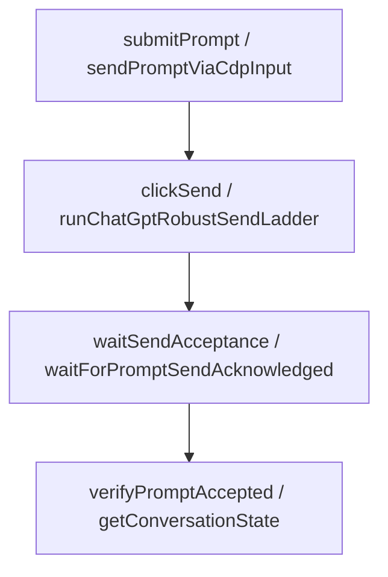

# Phase 10 Walkthrough – ChatGPT Send & Composer Extraction

Strict zero-behavior refactor completed.

## Audits & Statistics

### Line Statistics
- **Lines removed from `main.js`**: 2,143 lines
- **Lines added to `chatgpt_send.js`**: 1,205 lines
- **Lines added to `chatgpt_dom.js`**: 752 lines

### Extracted Functions
Extracted **16** Node CDP composer/send helpers:
- `isLikelyChatGptSendButtonText`
- `clickSendButtonViaCdp`
- `forceClickChatGptComposerSubmit`
- `waitForHeavyChatGptPromptDomCooldown`
- `runChatGptRobustSendLadder`
- `forceSubmitChatGptComposerWithCdp`
- `sendPromptViaCdpInput`
- `waitForChatGptComposerIdle`
- `waitForPromptSendAcknowledged`
- `sendPromptViaCdpInputSingle`
- `waitForNv2GenerationStartGuard`
- `sendNv2PromptViaDeepCdpInput`
- `vidoraReadChatGptComposerStateReal`
- `vidoraClickChatGptRealSendButton`
- `vidoraChatGptInputGate`
- `vidoraClearChatGptInputBeforePaste`

Extracted/moved **10** browser DOM-injected scripts:
- `focusPromptInputScript`
- `setPromptInputValueScript`
- `deepFocusNv2ComposerScript`
- `clearNv2ComposerScript`
- `dispatchNv2ComposerInputEventsScript`
- `forceSubmitChatGptComposerScript`
- `inspectAndClickChatGptSendButton`
- `inspectAndClickChatGptSendButtonSafely`
- `clickSendButtonScript`
- `sendPromptScript`

---

## Dependency Report

- **Imports** in `chatgpt_send.js`:
  - `../logging` (appendAppLog)
  - `../utils` (sleep)
  - `../state` (verifyDraftOwnership)
  - `./chatgpt_core` (evaluateOnCdpPage, getConversationState)
  - `./chatgpt_dom` (DOM scripts)
- **Exports** in `chatgpt_send.js`:
  - `initChatGptSend`
  - 16 Node helpers
- **Globals used**:
  - `globalThis.chatGptSendStates` (via `setChatGptSendState`)
  - `globalThis.__vidoraLastComposerState`
- **Runtime injections**:
  - `setChatGptSendState`
  - `assertPipelineRunActive`
  - Injected via `initChatGptSend(chatGptRuntime)`
- **Circular dependency result**: 0 circular loops detected.

---

## Call Graph

---

## Global Usage Audit
- **globalThis.chatGptSendStates**: Yes (indirectly via `setChatGptSendState` injection)
- **globalThis.__vidoraLastComposerState**: Yes (stored inside evaluation callbacks)
- **Map / WeakMap / Timer / IPC / BrowserWindow**: None
- **CDP client**: Passed as parameter `client` or `page` to helper functions.

---

## Exact Body Audit
- **Exact moved function bodies match HEAD**: `PASS`

---

## Export Audit
- **All extracted functions exported**: `PASS`

---

## Forbidden Import Audit
- **`chatgpt_send.js` -> `main.js` imports count**: 0 occurrences (`PASS`)

---

## Main.js Statistics
- **Current `main.js` line count**: 17,534 lines
- **Current function count**: 313 functions
- **Largest remaining function**: `runScenePipelineLockedInternal` (726 lines)
- **Top 10 largest functions**:
  1. `runScenePipelineLockedInternal` (726 lines)
  2. `waitForLatestChatGPTGeneratedImage` (690 lines)
  3. `extractLatestChatGPTGeneratedImageBytesScript` (431 lines)
  4. `readLatestAssistantScript` (417 lines)
  5. `runScenePipelineLocked` (404 lines)
  6. `submitGrokVideoPrompt` (373 lines)
  7. `hydrateFreshChatGptContextAfterRotation` (321 lines)
  8. `generateVideoWithGenericProvider` (314 lines)
  9. `getGrokSendPreflightScript` (286 lines)
  10. `generateImageAndMotionWithChatGPT` (257 lines)

---

## Verification & Execution Results
- `node --check electron/main.js`: `PASS`
- `node --check electron/main/chatgpt/chatgpt_send.js`: `PASS`
- `node --check electron/main/chatgpt/chatgpt_dom.js`: `PASS`
- `node --check electron/main/chatgpt/index.js`: `PASS`
- `npm test` suite: `PASS`
