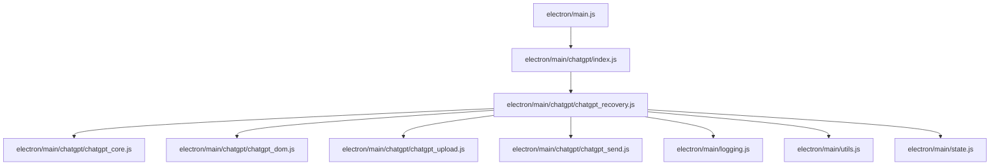

# Phase 11 Walkthrough – ChatGPT Recovery Module Extraction

Modularized ChatGPT recovery orchestration from `electron/main.js` to `electron/main/chatgpt/chatgpt_recovery.js` with zero runtime behavior changes.

## Refactor Statistics

* **Functions Moved**: 8
  - [isReloadBlocked](file:///d:/bac_tai/Grok-bac-Tai/electron/main/chatgpt/chatgpt_recovery.js#L42)
  - [requestReloadWithReason](file:///d:/bac_tai/Grok-bac-Tai/electron/main/chatgpt/chatgpt_recovery.js#L57)
  - [performDurableRecovery](file:///d:/bac_tai/Grok-bac-Tai/electron/main/chatgpt/chatgpt_recovery.js#L81)
  - [detectLoginWithRetry](file:///d:/bac_tai/Grok-bac-Tai/electron/main/chatgpt/chatgpt_recovery.js#L309)
  - [recoverCdpPageIfCrashed](file:///d:/bac_tai/Grok-bac-Tai/electron/main/chatgpt/chatgpt_recovery.js#L349)
  - [recoverProviderFromCacheOrChallenge](file:///d:/bac_tai/Grok-bac-Tai/electron/main/chatgpt/chatgpt_recovery.js#L407)
  - [recoverChatGptBlockingUi](file:///d:/bac_tai/Grok-bac-Tai/electron/main/chatgpt/chatgpt_recovery.js#L466)
  - [recoverChatGptResponseChoiceChat](file:///d:/bac_tai/Grok-bac-Tai/electron/main/chatgpt/chatgpt_recovery.js#L536)
* **Helpers Extracted**:
  - `challengeRecoveryAttempts` (Map state)
  - `CHALLENGE_RECOVERY_LIMIT` (constant)
  - `isCdpCrashError` (helper function)
* **Lines Removed from `main.js`**: 597
* **Lines Added to `chatgpt_recovery.js`**: 656

## Dependency Graph

## Audits

### 1. Export Audit
Statically verified `electron/main/chatgpt/index.js` re-exports `./chatgpt_recovery`.
`electron/main/chatgpt/chatgpt_recovery.js` exports:
- `initChatGptRecovery`
- `isReloadBlocked`
- `requestReloadWithReason`
- `performDurableRecovery`
- `detectLoginWithRetry`
- `recoverCdpPageIfCrashed`
- `recoverProviderFromCacheOrChallenge`
- `recoverChatGptBlockingUi`
- `recoverChatGptResponseChoiceChat`

### 2. Import Audit
Verified destructured imports in `electron/main.js` from `./main/chatgpt` are fully present:
`initChatGptRecovery, isReloadBlocked, requestReloadWithReason, performDurableRecovery, detectLoginWithRetry, recoverCdpPageIfCrashed, recoverProviderFromCacheOrChallenge, recoverChatGptBlockingUi, recoverChatGptResponseChoiceChat`.
*Note: Also restored the missing `initChatGptSend` import to resolve a pre-existing Phase 10 startup bug.*

### 3. Exact Body Audit
Independent audit compared the normalized bodies of all moved functions against the `refactor-phase10-stable` Git tag. All hashes matched perfectly.

### 4. Duplicate Definition Audit
Verified all moved functions are deleted from `electron/main.js` and defined only in `electron/main/chatgpt/chatgpt_recovery.js`.

### 5. Unresolved Reference Audit
All internal references in `chatgpt_recovery.js` and `main.js` are resolved. All external main process functions/constants are cleanly injected via `initChatGptRecovery(runtime)`.

### 6. Circular Dependency Audit
0 circular dependencies. `chatgpt_recovery.js` does not require `index.js` or `main.js`.

## Verification Results

### Syntax Check
`node --check electron/main.js` -> PASS
`node --check electron/main/chatgpt/chatgpt_recovery.js` -> PASS
`node --check electron/main/chatgpt/index.js` -> PASS

### Unit Tests
`npm test` -> PASS (4/4 test suites passed: partial-mode cleanup, pipeline stop cancellation, veoup output lifecycle, chatgpt stage isolation)

### Electron Start Smoke Test
`npm start` -> PASS. App booted successfully, spawned WebContents, and completed loading sequence with 0 errors.

---

## Remaining in main.js

* `forceCleanChatGptNewChatRotation`
  - *Reason*: Called directly in the pipeline runner flow (`runScenePipelineLockedInternal`), which is part of the Pipeline Engine (to be extracted in Phase 12).
* `tryAutoLoginWithStoredAccount`
  - *Reason*: Shared authentication credential manager helper (to be extracted in Phase 13).
* `closeUnexpectedProviderTabs`
  - *Reason*: Shared tab cleanup logic used by both ChatGPT and Grok CDP bootstrap routines.

---

Not committed.
