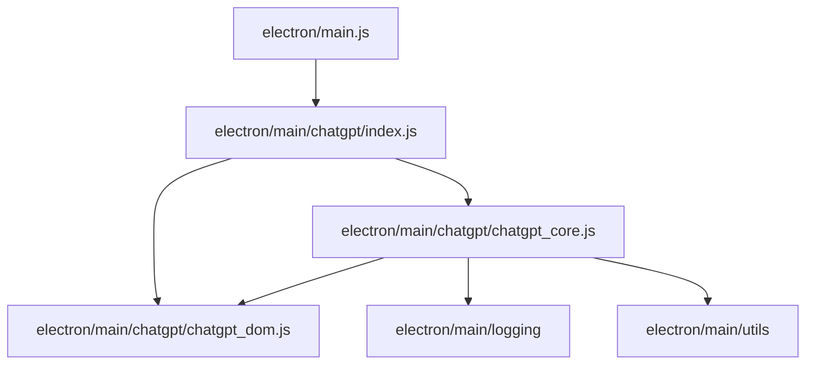

# Phase 8 Walkthrough – ChatGPT Core Helpers Extraction

## Summary

Strict zero-behavior refactor completed.

Moved shared ChatGPT core helpers from [main.js](file:///d:/bac_tai/Grok-bac-Tai/electron/main.js) into [chatgpt_core.js](file:///d:/bac_tai/Grok-bac-Tai/electron/main/chatgpt/chatgpt_core.js).

## Files Changed

### [MODIFY] [main.js](file:///d:/bac_tai/Grok-bac-Tai/electron/main.js)

- Added extracted core helper names to existing `require("./main/chatgpt")` destructuring.
- Removed moved function declarations only.
- Kept all call sites unchanged.

### [NEW] [chatgpt_core.js](file:///d:/bac_tai/Grok-bac-Tai/electron/main/chatgpt/chatgpt_core.js)

Extracted 4 functions:

- `getChatGptSendState`
- `getConversationState`
- `waitForCdpLoad`
- `evaluateOnCdpPage`

### [MODIFY] [index.js](file:///d:/bac_tai/Grok-bac-Tai/electron/main/chatgpt/index.js)

- Added `...require("./chatgpt_core")` to ChatGPT barrel exports.

## Line Counts

Phase 8 snapshot line counts:

| File | Lines |
|---|---:|
| `electron/main.js` before Phase 8 | 20011 |
| `electron/main.js` after Phase 8 | 19801 |
| `electron/main/chatgpt/chatgpt_core.js` | 225 |

Phase 8 removed from [main.js](file:///d:/bac_tai/Grok-bac-Tai/electron/main.js): **210 lines**.

Phase 8 added to [chatgpt_core.js](file:///d:/bac_tai/Grok-bac-Tai/electron/main/chatgpt/chatgpt_core.js): **225 lines**.

## Dependency Graph



## Circular Dependency Check

Command:

```powershell
Select-String -Path electron/main/chatgpt/chatgpt_core.js -Pattern 'require\('
Select-String -Path electron/main/chatgpt/chatgpt_core.js -Pattern 'main\.js|\.\./\.\./main|pipeline|recovery'
```

Allowed imports found:

```text
electron\main\chatgpt\chatgpt_core.js:1:const { appendAppLog } = require("../logging");
electron\main\chatgpt\chatgpt_core.js:2:const { sleep } = require("../utils");
electron\main\chatgpt\chatgpt_core.js:3:const { getConversationStateScript } = require("./chatgpt_dom");
```

Forbidden import scan result: no output.

Result: PASS. No import from `main.js`, `pipeline/*`, or `recovery/*`.

## Export Audit

Command used Electron mock for Node-only export check because `../logging` reads `electron.app.getPath()` at module load.

```powershell
node -e "const Module=require('module'); const originalLoad=Module._load; Module._load=function(request,parent,isMain){ if(request==='electron') return {app:{getPath:()=>process.cwd()},BrowserWindow:{getAllWindows:()=>[]}}; return originalLoad.apply(this,arguments); }; const mod=require('./electron/main/chatgpt'); const names=['getChatGptSendState','getConversationState','waitForCdpLoad','evaluateOnCdpPage']; const missing=names.filter(n=>typeof mod[n]!=='function'); console.log({missing, core:names.map(n=>[n, typeof mod[n]])}); if(missing.length) process.exit(1);"
```

Result:

```json
{"missing":[],"core":[["getChatGptSendState","function"],["getConversationState","function"],["waitForCdpLoad","function"],["evaluateOnCdpPage","function"]]}
```

## Exact Body Preservation Audit

Compared extracted function bodies against Phase 8 pre-extraction snapshot, normalizing line endings only for comparison.

Result:

```text
Exact moved function bodies match pre-extraction snapshot for 4 functions
```

## Syntax Checks

Command:

```powershell
node --check electron/main.js
node --check electron/main/chatgpt/chatgpt_core.js
node --check electron/main/chatgpt/index.js
```

Result: PASS.

## Test Suite

Command:

```powershell
npm test
```

Result:

```text
partial-mode cleanup tests passed
pipeline stop cancellation tests passed
veoup output lifecycle tests passed
chatgpt stage isolation tests passed
```

## `npm start` Smoke Test

Command launched app and terminated after 5 seconds.

Result:

```text
npm start launched and stayed alive for 5 seconds (smoke PASS)
```

## Behavior Report

- Zero behavior change intended.
- Zero logic change.
- Zero retry change.
- Zero recovery change.
- Zero pipeline change.
- Zero selector change.
- Zero timeout change.
- Zero state-machine change.
- Function signatures preserved.
- Function bodies match pre-extraction snapshot exactly.
- Call sites unchanged.

## Git Status Snapshot

```text
 M electron/main.js
 M electron/main/chatgpt/index.js
?? electron/main/chatgpt/chatgpt_core.js
?? electron/main/chatgpt/chatgpt_dom.js
?? walkthrough.md
```

> [!NOTE]
> [chatgpt_dom.js](file:///d:/bac_tai/Grok-bac-Tai/electron/main/chatgpt/chatgpt_dom.js) is from Phase 7 and remains untracked in this working tree.
