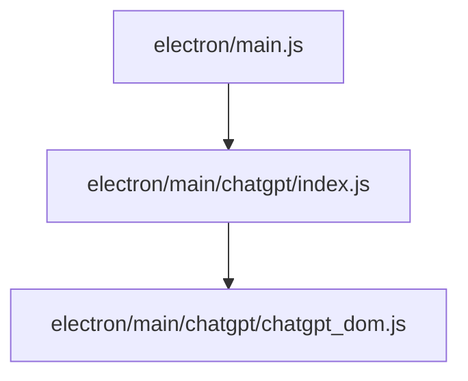

# Phase 7 Walkthrough – ChatGPT DOM & Detection Extraction

## Summary

Strict zero-behavior refactor completed.

Moved ChatGPT DOM/detection/parsing script helpers from [main.js](file:///d:/bac_tai/Grok-bac-Tai/electron/main.js) into [chatgpt_dom.js](file:///d:/bac_tai/Grok-bac-Tai/electron/main/chatgpt/chatgpt_dom.js).

## Files Changed

### [MODIFY] [main.js](file:///d:/bac_tai/Grok-bac-Tai/electron/main.js)

- Added CommonJS destructured import from `./main/chatgpt`.
- Removed moved function declarations.
- Left call sites unchanged, including `(${fn.toString()})()` execution pattern.

### [NEW] [chatgpt_dom.js](file:///d:/bac_tai/Grok-bac-Tai/electron/main/chatgpt/chatgpt_dom.js)

Extracted 14 functions:

- `detectLoginScript`
- `countAssistantMessagesScript`
- `detectBrowserCrashPageScript`
- `dismissChatGptBlockingUiScript`
- `detectChatGptResponseChoiceUiScript`
- `detectChatGptActiveGenerationScript`
- `detectChatGptActiveGenerationScriptStrict`
- `getComposerTextScript`
- `getActiveComposerTextScript`
- `inspectNv2ComposerSubmitStateScript`
- `countChatGptAssistantRootsScript`
- `getConversationStateScript`
- `clickChatGptStopGeneratingScript`
- `readChatGptImageStateScript`

### [MODIFY] [index.js](file:///d:/bac_tai/Grok-bac-Tai/electron/main/chatgpt/index.js)

- Re-exported [chatgpt_dom.js](file:///d:/bac_tai/Grok-bac-Tai/electron/main/chatgpt/chatgpt_dom.js).

## Line Counts

| File | Lines |
|---|---:|
| [main.js](file:///d:/bac_tai/Grok-bac-Tai/electron/main.js) | 20011 |
| [chatgpt_dom.js](file:///d:/bac_tai/Grok-bac-Tai/electron/main/chatgpt/chatgpt_dom.js) | 1569 |
| [index.js](file:///d:/bac_tai/Grok-bac-Tai/electron/main/chatgpt/index.js) | 4 |

Diff stat for tracked files:

```text
electron/main.js               | 1745 +++-------------------------------------
electron/main/chatgpt/index.js |    4 +-
```

## Dependency Graph



## Circular Dependency Check

`chatgpt_dom.js` has no `require(...)` calls.

Commands:

```powershell
Select-String -Path electron/main/chatgpt/chatgpt_dom.js -Pattern 'require\('
Select-String -Path electron/main/chatgpt/index.js -Pattern 'main\.js|\.\./\.\./main|\.\./pipeline|\.\./recovery'
```

Result: no output.

## Export Check

Command:

```powershell
node -e "const mod=require('./electron/main/chatgpt'); const names=['detectLoginScript','countAssistantMessagesScript','detectBrowserCrashPageScript','dismissChatGptBlockingUiScript','detectChatGptResponseChoiceUiScript','detectChatGptActiveGenerationScript','detectChatGptActiveGenerationScriptStrict','getComposerTextScript','getActiveComposerTextScript','inspectNv2ComposerSubmitStateScript','countChatGptAssistantRootsScript','getConversationStateScript','clickChatGptStopGeneratingScript','readChatGptImageStateScript']; const missing=names.filter(n=>typeof mod[n]!=='function'); const extra=Object.keys(mod).filter((n,i,a)=>a.indexOf(n)!==i); console.log({exportCount:Object.keys(mod).length, missing, exported:Object.keys(mod)}); if(missing.length||extra.length) process.exit(1);"
```

Result:

```text
exportCount: 14
missing: []
```

## Exact Body Preservation Audit

Compared moved function bodies against `HEAD:electron/main.js` with line endings normalized only for comparison.

Result:

```text
Exact moved function bodies match HEAD for 14 functions
```

## Syntax Checks

Command:

```powershell
node --check electron/main.js; node --check electron/main/chatgpt/chatgpt_dom.js; node --check electron/main/chatgpt/index.js
```

Result: PASS.

## Test Suite

Command:

```powershell
npm test
```

Result:

```text
partial-mode cleanup tests passed
pipeline stop cancellation tests passed
veoup output lifecycle tests passed
chatgpt stage isolation tests passed
```

## `npm start` Smoke Test

Command launched app and terminated after 5 seconds.

Result:

```text
npm start launched and stayed alive for 5 seconds (smoke PASS)
```

## Behavior Report

- No selector changed.
- No timeout changed.
- No retry behavior changed.
- No recovery behavior changed.
- No pipeline behavior changed.
- No upload behavior changed.
- No hydration behavior changed.
- No prompt/send flow changed.
- Moved function bodies match original bodies exactly.

## Git Status Snapshot

```text
 M electron/main.js
 M electron/main/chatgpt/index.js
?? electron/main/chatgpt/chatgpt_dom.js
```

Git warning seen:

```text
LF will be replaced by CRLF the next time Git touches it
```

No `git diff --check` whitespace errors.
